1. [Introduction](#1)
2. [Sensors And Transducers](#2)
3. [Example Sensors And Transducers](#3)
4. [Applications Various Sensors And Transducers](#4)
5. [First Group Of Sensor](#5)
6. [Potentiometer Sensor](#6)
7. [Correlation](#7)
8. [Various Applications Of The Potentiometer](#8)

---

 

### 1. Introduction

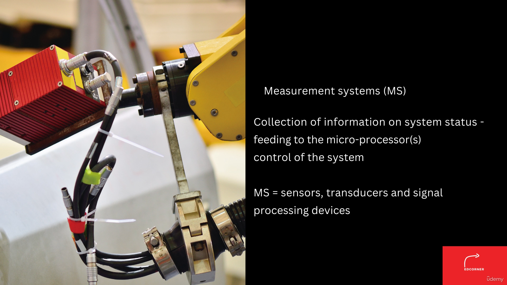

 

### 2. Sensors And Transducers

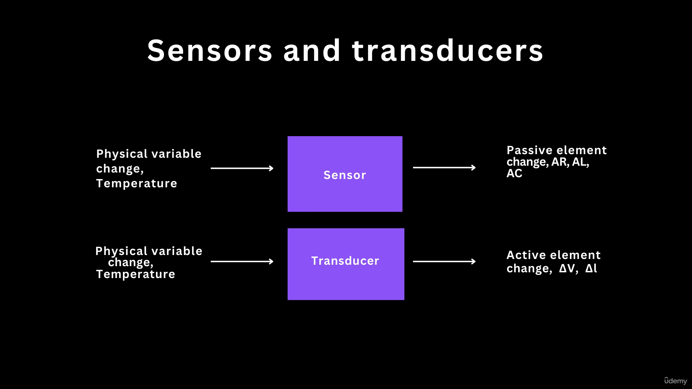

 

### 3. Example Sensors And Transducers

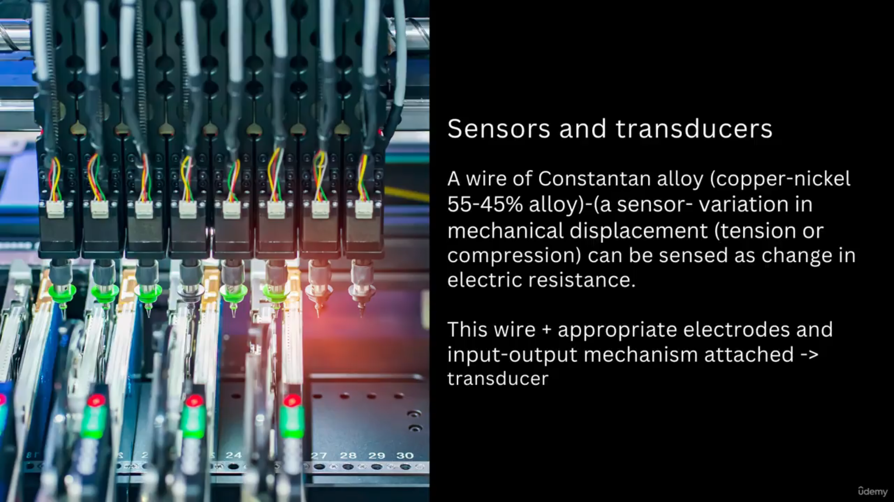

 

### 4. Applications Various Sensors And Transducers

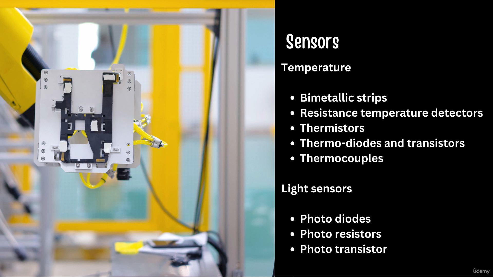

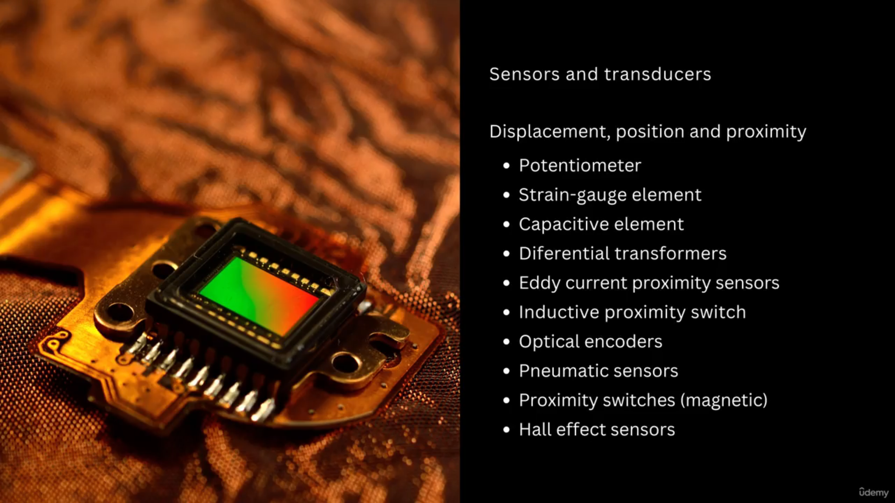

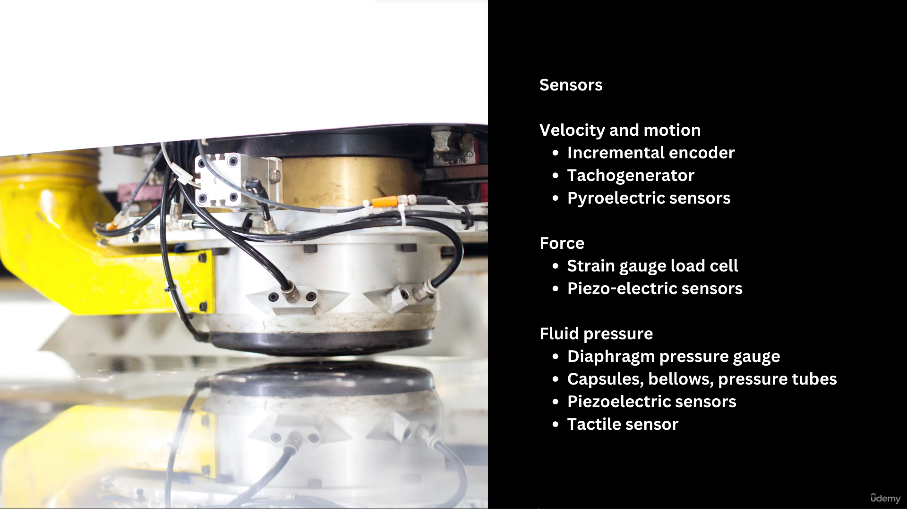

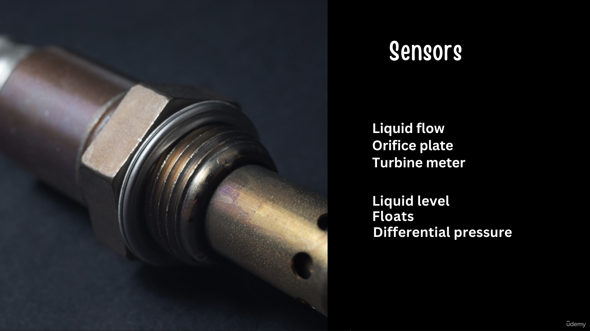

 

### 5. First Group Of Sensor

 

### 6. Potentiometer Sensor

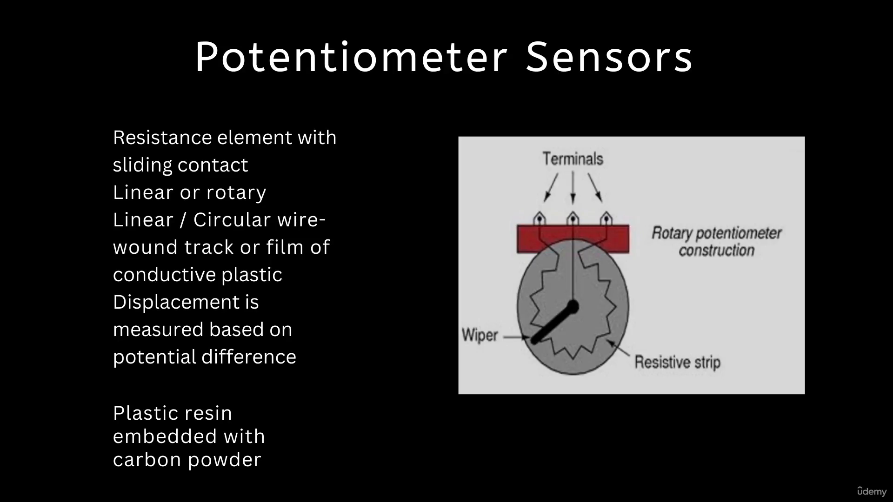

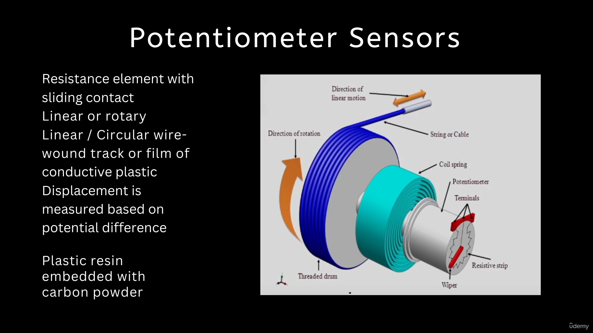

 

### 7. Correlation

 

### 8. Various Applications Of The Potentiometer

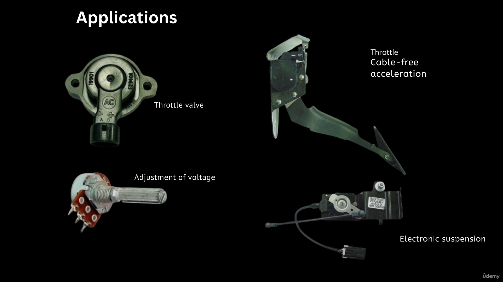

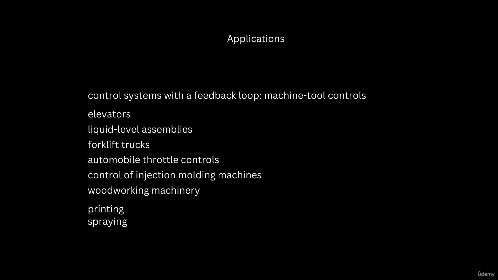

 
