1. [Introduction](#1)
2. [Sensors And Transducers](#2)
3. [Example Sensors And Transducers](#3)
4. [Applications Various Sensors And Transducers](#4)
5. [First Group Of Sensor](#5)
6. [Potentiometer Sensor](#6)
7. [Correlation](#7)
8. [Various Applications Of The Potentiometer](#8)

---

 

### 1. Introduction

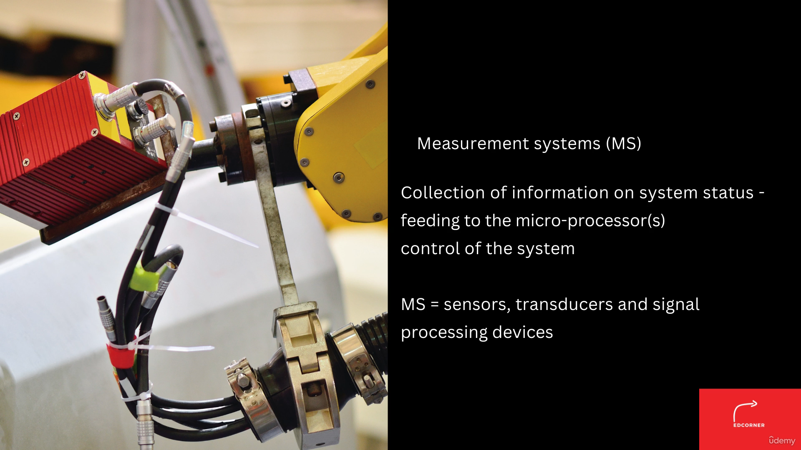

The outline of this section.
At the start of the lecture we will study the meaning of measurement system its elements.
Then we will learn the definition of sensors and transducers.
We will see what is the difference between the concept of a sensor and a transducer.
After that, we will see the classification of sensors or the types of sensors.
And we will start learning the constructional details of a typical potentiometer sensor, its principle
of operation and its applications in the industry.
While the fundamental element of measurement system is sensor, a lot of sensors are being used in automation.
We will try to see some of the important sensors which are used in automation applications in manufacturing.
Let us begin our discussion on the measurement system.
It is primarily developed to collect the information on the system status.

 

### 2. Sensors And Transducers

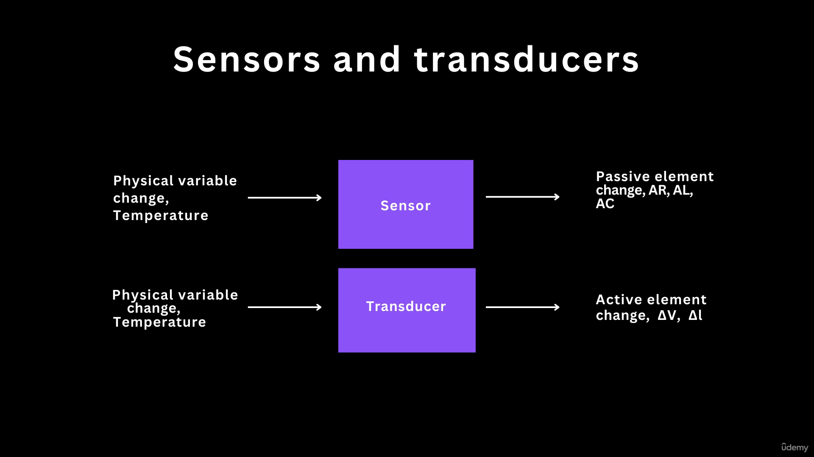

What is the meaning of a sensor?
The definition of a sensor is a physical element which produces a signal relating to the quantity being
measured.
Sensor is a physical element which senses the measurement and it generates a signal and produces a signal.
This is called a sensor.
What may be the physical variables?
A temperature can be called a physical variable, or displacement can be called a physical variable,
or we may also call the noise or the vibrations.
These are the input variables or the physical variables and we need to measure them.
A sensor is a physical element which senses these variables and it generates certain signals.
That signals may be change in resistance, change in inductance, or change in capacitance, but change
in resistance or inductance and capacitance may not be useful for microprocessor application.
Why?
Because the microprocessor understand the language of zeros and one, and these zeros and ones are nothing
but the voltages.
We need to have a signal in terms of change in voltage or a sequence of pulses, and that pulses are
nothing but change in voltage.
When we say that a sensor which produces the change in voltage or change in current, which can be understood
by the microprocessor, that system is called as the transducer.
Transducer by definition, is a device which converts one form of energy into the other form of energy.
We can call all the sensors or transducers, but all transducers are not sensors.

 

### 3. Example Sensors And Transducers

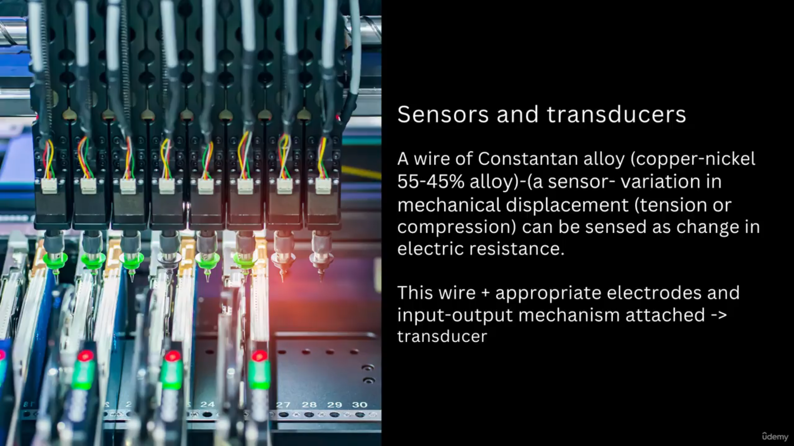

Well.
A simple example is a wire of constant, an alloy, a metal alloy, and it has two elements copper and
nickel.
The proportion is 55 percentage of copper and 45 percentage of the nickel.
This alloy can be called a sensor as it is generating a signal when there is a change in physical variable.
Let us consider the change in physical variable that to be measured is mechanical displacement.
Mechanical displacement.
We are providing in terms of tension or compression when When this element mechanical element is applied
with tension or the compression, then there is a change in electrical resistance of this Constantin
alloy.
As we are pulling a wire or element made up of the Constantin alloy, there is a change in resistance
or we compress it.
Then there is a change in resistance.
But this change in resistance will not be useful to take the appropriate decision by the microprocessor.
For that purpose, we need to add few electrodes.
We need to have input output mechanism.
And when we add this to the sensor, then we are having a transducer.
In automation or in applications of the sensors we are using the additional elements additional processing
devices.
These are the signal processing devices.
We will be learning the signal processing devices in the later part of our lecture.
Nowadays there is a concept of smart sensors are also coming into the industry.
The concept of smart sensor is nothing, but it is a plug and play kind of device.
As we have seen sensor, it is a simple physical element.
Transducer is having a physical element and a signal processing device.
The smart sensors are one step ahead.
The smart sensors are having physical element, signal processing device, and microprocessor as well.
We can consider a smart sensor as a plug and play device.
You just plug it and you can simply sense the variable.
These devices, they are having self-calibration capability.
They can adjust with changes in the environment.
And they are very intelligent.
They are having the capability to communicate with variety of other devices which are not in the transducers.
Well, such type of sensors are being used as an independent devices in the manufacturing domain nowadays.

 

### 4. Applications Various Sensors And Transducers

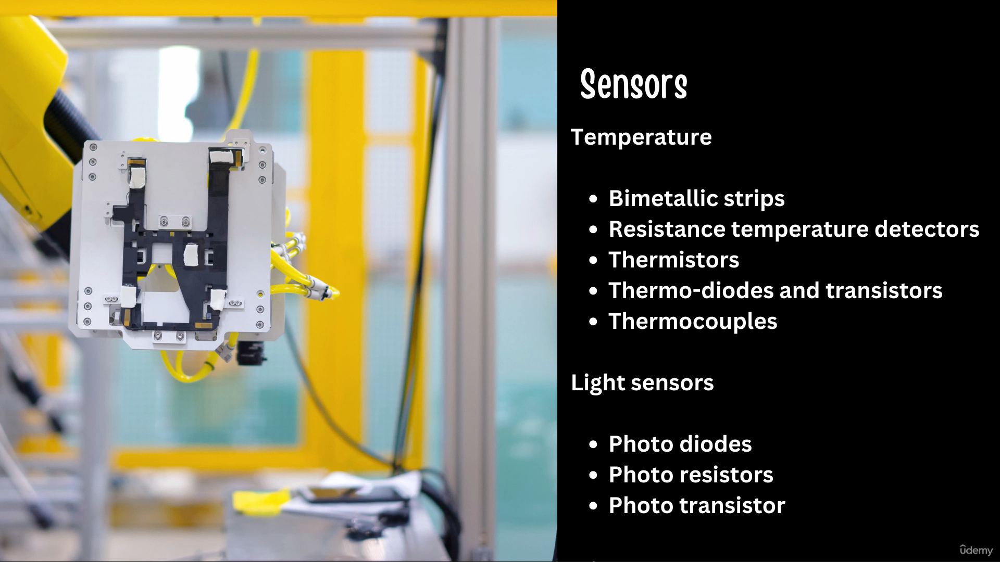

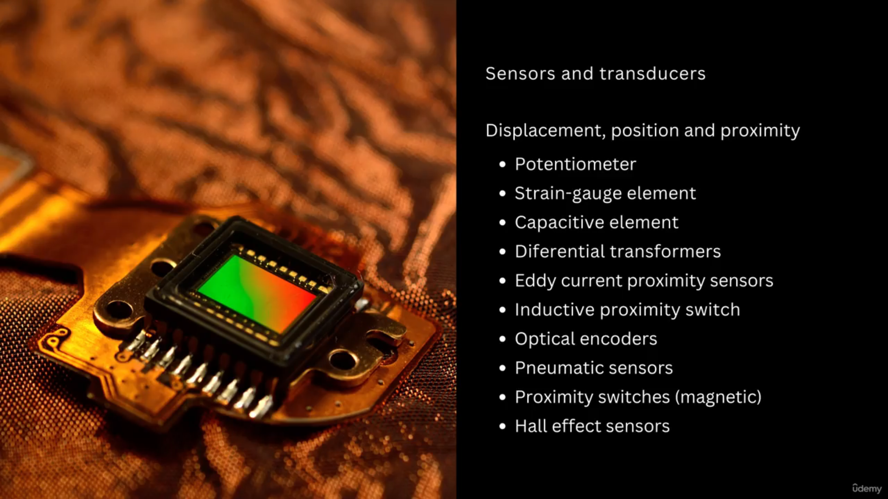

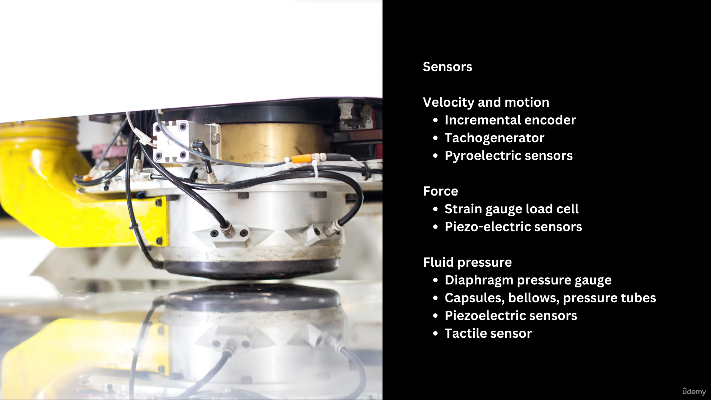

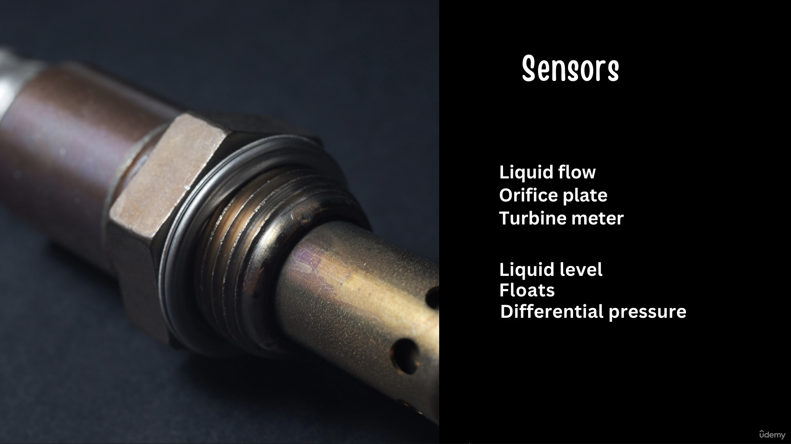

Now let us look at various sensors and transducers which are used in manufacturing automation.
The first type of sensors are displacement position and proximity sensors.
The automated systems have various mechanisms and these mechanisms have various linkages, various elements.
During the process of operation, these linkages and elements they displace.
There is a movement.
There is a motion of these elements or linkages.
We need to monitor the displacement of these linkages or the elements.
Second is the position.
The automated systems are moving inside a shop floor, and we need to track the position of this system
inside the shop floor.
We need to track the position.
We need to locate the devices in the specified the space.
For that purpose we need position sensors.
Proximity.
Proximity is the closeness with the object when the objects are coming closer to the equipment or the
instrument.
We need to generate certain signals to know the proximity of that elements or proximity of the objects.
For that purpose, we need the proximity sensors.
Displacement position and the proximity.
There are various sensors.
These sensors are listed on your screen.
Potentiometer.
Strain gauge element.
Capacitive element.
Differential transformers.
Eddy current proximity sensors.
Inductive proximity switch.
Optical encoders.
Pneumatic sensors.
Proximity switches.
Hall effect sensors and many more.
These sensors are in general used in the manufacturing automation.
In addition to the displacement position and the proximity sensors, we also need to measure the variables
such as velocity and motion of either the physical elements of the equipment or the objects for which
we are carrying out the automated processing operations.
For velocity and motion, incremental encoders, tachogenerators and piezoelectric sensors are used.
We also need to measure the force.
For that purpose, strain gauge based load cells and piezoelectric based sensors are used.
in automation.
There are a lot of fluids being used.
It may be gas or it may be a liquid in gas air or it may be some other gases are to be used for the
applications or in fluid.
It may be water or some chemicals, or it may be a syrup.
For that purpose, various sensors are used diaphragm pressure gauge capsules.
Bellows and pressure tubes.
Piezoelectric sensors and tactile sensors.
Then the flow of the liquid to measure the flow of liquid orifice plate and turbine meter are used to
sense the level of the liquid.
Floats and differential pressure gauges are used.
Temperature is a very important parameter as far as the process monitoring and control is concerned.
Temperature suggest or temperature indicates the health of the equipment as well for that purpose.
Bimetallic strips or rtds, that is, resistance temperature detectors, thermistors thermo diodes and
transistors and thermocouples are used.
Lights are used to carry out the office automation or the home automation for that purpose.
Various diodes, resistors, and transistors are used.

 

### 5. First Group Of Sensor

Now let us come to our first group of sensor that is displacement position and proximity sensor.
As I mentioned, we need to measure of an amount by which an object has been moved.
This object may be the mechanism or the element of a particular mechanism of a machine or an equipment,
or it may be the object.
We need to measure the displacement.
We need to track the displacement.
We need to record the displacement then the position sensor.
These sensors are used to determine the position of an object in relation to some reference point.
This reference point may be a reference point of the equipment, or it may be the reference point of
the space in which the objects are moving.
Third is proximity sensor.
The proximity sensors are the type of position sensors only, and they are detecting the moment of the
object with some particular critical distance of the sensor.
If the object is coming closer to the sensor, and if it is crossing the critical distance, then the
sensor detects that object.
These sensors are available in the industry and contact or non-contact mode.

 

### 6. Potentiometer Sensor

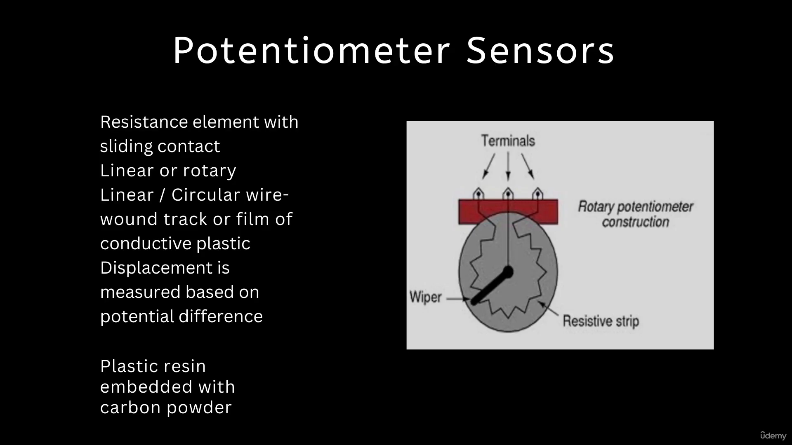

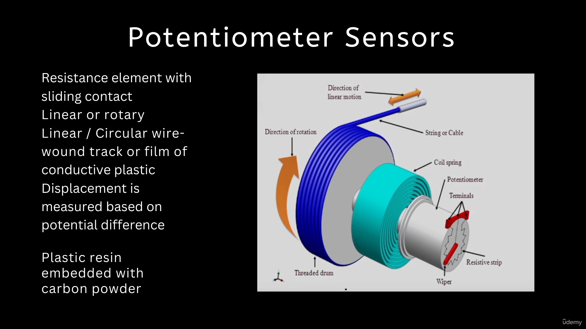

Potentiometer sensor has a resistance element and a sliding contact.
These are available in linear or rotary format.
As the length of the sliding contact changes, the resistance of the system changes and that resistance
is producing further voltage output.
The length of the sliding contact is affecting the resistance of the system, and it is affecting the
potential difference across the connections.
If we connect the sliding contact with the physical element of which we need to measure the displacement,
we can easily compute the displacement by calibrating the change in potential difference inside the
circuit.
A typical linear potentiometer has a long wire, and there is a slider.
Such a long wire based linear potentiometer it is difficult to handle.
It is tedious and we cannot use this as a sensor for that purpose.
The rotary modes or rotary type of potentiometers are used as sensors.
These rotary sensors has wire wound track or a film of conductive plastic.
This wire wound track has number of turns over the core of the sensor, and as the wiper, or as the
slider is getting contacted with the turns, we are measuring the resistance according to the contact
of the slider, with a typical number of or a specified number of turn on the circular wound track.
The resistance we can get when the connecting two or it is contacting to a wire.
Nowadays a film of conductive plastic is also used.
This film is nothing but a plastic resin which is embedded with carbon powder.
Instead of having number of turned coils, the carbon powder is embedded with plastic resin and the
wiper is moving over the plastic resin.
The carbon powder is conducting.
Wherever the wiper is connecting, we are getting the resistance accordingly.
A typical application of potentiometer sensor is shown on the screen.
Here we need to measure the linear displacement by using a rotary type potentiometer sensor.
For that purpose we are getting a string or a cable.
We are winding this string or the cable over a threaded drum.
This drum is mounted on a shaft and on the shaft we are having a coil spring, and at the end of this
shaft we are having the potentiometer sensor.
The potentiometer sensor has a resistive strip and a wiper arrangement.
There are three terminals.
Two terminals of the resistive strip are attached to two ends of the wire.
This is the pulling element or the contact element of this sensor.
This element is in contact with the application of which we need to measure the displacement.
Consider there is a pull in this contact element.
As there is a pulling moment, the drum is rotating in clockwise direction and as the drum rotates in
clockwise direction, the wiper also rotates in clockwise direction.
As the wiper is rotating along the clockwise direction, there is a change in length of contact with
the resistive strip.
The distance.
The linear distance is the function of the change in contact length of the potentiometer sensor, and
further it is a function of the resistance.
This delta R will further be used to generate the appropriate signals, that is, a delta v or delta
I.
Current signals by using a Wheatstone bridge device because as you know, delta R signals cannot be
used by the microprocessor to process the information.
We need to convert these signals from one form of energy that is resistance to the voltage.
And then this the potentiometer sensors will be converted into a transducer.

 

### 7. Correlation

The correlation will be shown with a very simple circuit.
There is a resistance element sliding contact.
This resistance element has two ends A and B.
A has resistance r a and the node B has a resistance RB.
We are applying a supply voltage VZ across these two terminals two ends A and B.
The voltage at the sliding contacts is Vo.
We are applying a supply voltage VZ across these two terminals, two ends A and B, and the voltage
at the sliding contact is Vo.
Now let us try to find out the correlation.
The voltage at A is ei into RA, but the current which is flowing inside this circuitry can be written
in this format.
I is equal to the supply voltage and total resistance across A and B that is RA plus RB.
We can consider this.
This is an equation one and equation two.
Put equation 2 in 1.
Then we are getting VA is equal to vz into RA divided by ra plus rb.
The voltage at point A is a function of the supply voltage, which we know, which is the constant supply
voltage that we are applying resistance at node A and resistance at node B.
Now, as we know, the resistance R is directly proportional to length of the contact and is inversely
proportional to the area of the cross section of the wire.
R is equal to rho into L by a, which is quite well known equation where rho is nothing but the constant
of proportionality, and it is called as electrical resistivity.
Resistance is directly proportional to the length and inversely proportional to the area.
Let us use this correlation and modify the equation of VA.
What we get here.
VA is equal to supply voltage into the length of contact from point A, and the total length of the
resistance element that is la plus ELB.
As you can say from point A, if we are varying the sliding contact length, then we can consider there
is a change in potential difference that is nothing but the potentiometer.

 

### 8. Various Applications Of The Potentiometer

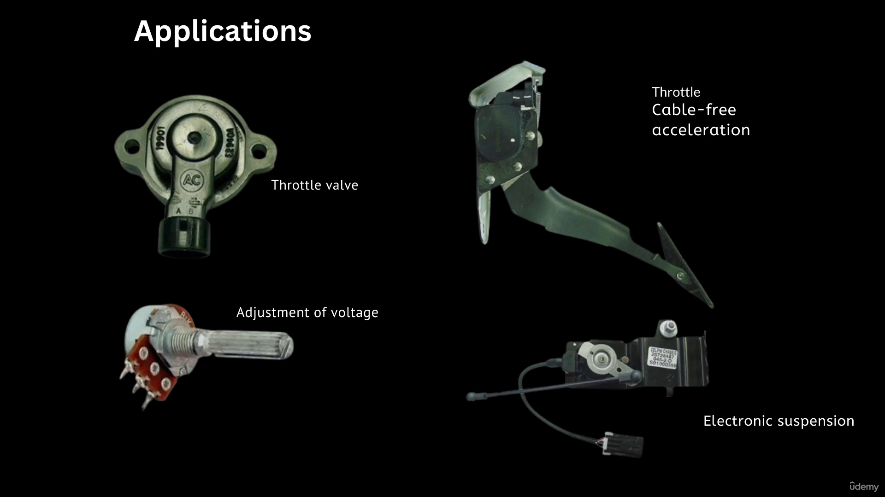

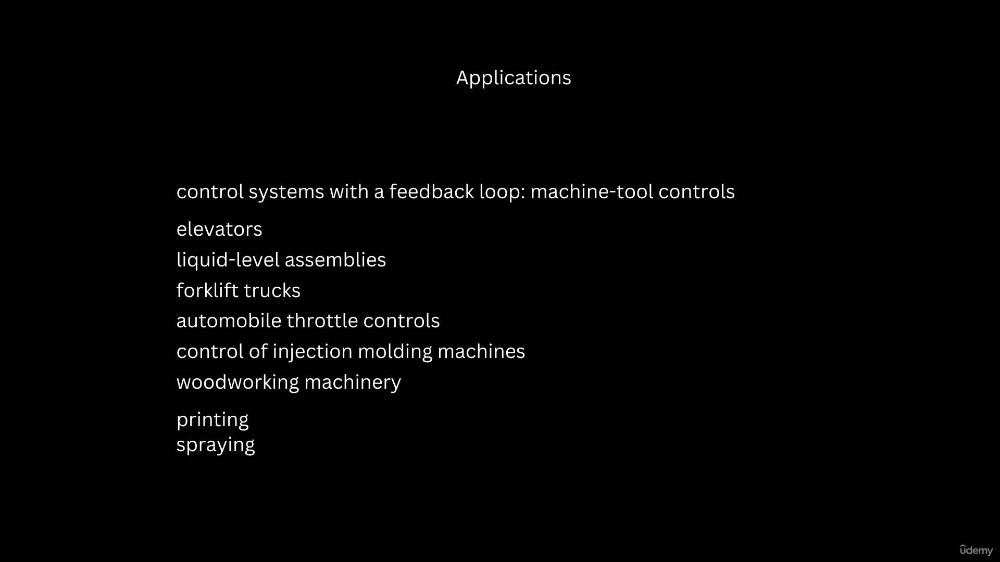

What are the various applications of the potentiometer?
Potentiometers are used in throttle valve.
Throttle valves are used to control the flow of the gas or the fluid inside the combustion chamber,
to monitor the operation, or to monitor the displacement of the element of the throttle valve.
These are either manually operated or the automatically operated when the manual operation is carrying
out, or when the automatic operations are carrying out.
So we need to monitor whether the specified or whether the desired amount of displacement is there or
not.
The next is adjustment of voltage.
This is a very common application.
We also do have a lot of electrical appliances at home.
The ceiling fan to control the speed of the ceiling fan, we are using a knob.
We are using a device and that device is having the potentiometer sensors.
We are just rotating the knob and accordingly there is a change in the speed.
Then for the acceleration as well.
So this is the pedal.
And when we apply pressure or a force on this pedal, this pedal is getting displaced.
We need to continuously monitor the displacement of the pedal.
Because this displacement of the pedal is accelerating the automobile or it is accelerating certain
process.
If it is beyond the limit, then we have to give certain alarm or we have to control the acceleration
for that purpose.
We need to have the control moment of this pedal.
Earlier it was used with the cables.
The next type of application is electronic suspension.
In this application, the lever which is attached to the axle of the automobile, the displacement of
that lever will be sensed by using the potentiometer sensor.
As the lever is moving, that moment can be sensed by the microprocessor.
The lever is moving due to the unevenness on the road as it is getting bumps, or you can say the vibrations
from the road unevenness through the axle that will be sensed by this lever.
And the microprocessor is taking certain decisions, or it is giving alarm to the writer either to control
the speed of the automobile, or it itself will take the decisions to control it.
In addition to this, there are a variety of other applications in machine tools, potentiometers are
required.
Machine tools has many elements or mechanisms.
There are displacement of these elements and mechanisms.
We need to monitor them for that purpose.
Potentiometer sensors are required.
Elevators the elevators are moving in upward direction or they are coming downward direction.
The movement or displacement of the elevators.
The liquid levels in assemblies to monitor the liquid levels.
These liquid levels are connected with a physical element or mechanical element as there is a change
in level of the liquid.
The mechanical elements are moving, that displacement can be monitored and the liquid level can be
controlled.
Forklift trucks.
The forklift trucks are having forklifts which are lifting the commodities.
The lift or the displacement of the forks that to be monitored for that purpose, we need the potentiometer
sensor.
This already I have talked to you.
The throttle valves.
Control of injection molding machine.
The injection molding machine has very critical parts that two dies that to be closed regularly.
And when we are carrying out the closing and opening operations of the dies and the molds in the injection
molding operation in a rapid way, we need to continuously monitor the opening and closing of these
dyes and molds and shutters.
For that purpose.
The potentiometer sensors are used then for the woodworking machinery to measure or to monitor the displacement.
Printing applications.
Printing machineries.
Spraying applications, robotics.
The potentiometer sensors are used.
Well, my friends, let us summarize the lecture one of week four.
In this lecture we studied the meaning of the measurement system.
It is an important building block of the mechatronics based automated system.
We learned the definition of the term sensor and transducer.
We understood the difference between a sensor and a transducer.
Then we looked at various types of sensors which are used in automation in manufacturing.

 
