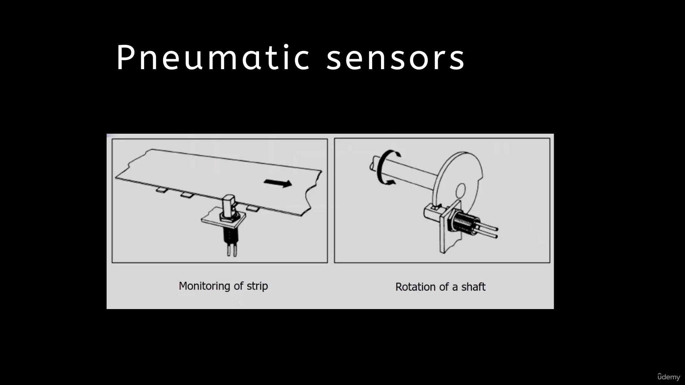

9. [Strain Gauge Element Sensor](#9)
10. [Strain Gauge 2](#10)
11. [Wheatstone Resistant Bridge Is Attached Strain Gage Element Sensor](#11)
12. [Strain Gage 4](#12)
13. [Strain Gage 5](#13)
14. [Strain Gauges Applications](#14)
15. [Capacitive Elements Sensor](#15)
16. [Capacitive Elements Sensor 2](#16)
17. [Typical Industrial Construction Of These Capacitive Sensors](#17)
18. [Applications Of Capacitive Element Sensor](#18)
19. [Linear Variable Differential Transformer (LVDT)](#19)
20. [Roller Spacing](#20)
21. [Injection Molding Machine](#21)
22. [Valve Opening And Closing](#22)
23. [LVDT Applications](#23)
24. [RVDT (Rotary Variable Differential transformer)](#24)
25. [Eddy Current Proximity Sensors](#25)
26. [Inductance](#26)
27. [Inductive Proximity Switches](#27)
28. [Applications](#28)
29. [Optical Encoders](#29)
30. [Optical Encoders 2](#30)
31. [Optical Encoders Servo Motor](#31)
32. [Pneumatic Sensors](#32)
33. [Pneumatic Sensors Applications](#33)
34. [Proximity Switches](#34)
35. [Photoelectric Sensors](#35)
36. [Hall Effect Sensors](#36)
37. [Applications Hall Effect Sensors](#37)
38. [Hall Effect Sensor For Controlling Or Monitoring Of Fuel](#38)

---

 
 

### 9. Strain Gauge Element Sensor

The next important displacement sensor is strain gauge element sensor.
It works on the principle of change in resistance when we are giving tension or compression to a mechanical
element.
On your screen, you can see a simple arrangement of a strain gauge element.
So it has a foil.
And that foil has two terminals.
And we are measuring resistance across these two terminals.
This foil is attached to the mechanical element of which we want to measure the strain.
When there is a tension in the foil, then the resistance of that foil or the resistance of that mechanical
element will increase, and when there is a compression, then the resistance will decrease.
So it works based upon the principle of electrical resistance.
And it is particularly measuring the mechanical strain inside the work parts or the body parts of automated
system.
Strain gauge sensors are available either in metal wire form or metal foil strip form.
The strain gauges are also made up of semiconductor material, so the advantage of semiconductor material
that it has high gauge factor, we will see the meaning of the gauge factor.
So as I said, the resistance is directly proportional to the strain in strain gauge element the ratio
of change in resistance of the mechanical element to its original resistance is directly proportional
to the strain that is developed in the mechanical element.
So I can write the change in resistance due to the strain to the original resistance is directly proportional
to the strain, and the constant of proportionality is called as the gauge factor.
So in general the gauge factor is about 2 to 4, and it is decided by conducting the actual experiments
in the laboratory.
This is called the calibration process.
In the calibration process, we are computing the gauge factor for known displacement for known strain
inside the mechanical element.
So for a known strain we are computing delta r.
That is change in resistance inside the coil or the foil.
And accordingly we are computing the G.
So in general, a gauge factor of 2 to 4 is noticed for the variety of mechanical elements.
The most common material which is used as the strain gauge material is Constantin alloy.
It has copper and nickel in the proportion of 55% of copper and 45% of nickel.

 

### 10. Strain Gauge 2

Two more pictures are there on your screen.
In the first picture you can see a thin foil, and on the thin foil a wire is wound.
It is attached.
In the second picture we are having a metal foil.
The foil is again instead of a wire, it is a foil is nothing but a thin layer of the metal, which
is cut as per the required dimension.
This foil is in continuous mode that you can see and it has the connection leads.
As I mentioned, the foils are also made up of Constantine alloy and the foils are of size of a postage
stamp.
And we are pasting these postage stamp like strain gauges on the mechanical element of which we want
to measure the strain.
The metal foils are attached to the plastic, and that we call the bonding to the plastic by using epoxy
material or glass fiber reinforced epoxy material.
And this entire strip which is having the metal foil or the metal wire and the plastic material is secured
to the workpiece by using, again, a epoxy or a special material that is cyanoacrylate cement.
Eastman of number nine tensile.
These are the materials which are helping us to paste the postage stamp size, strain gauge elements
on the machine tools, or on the product of which we want to measure the strain or the displacement.

 

### 11. Wheatstone Resistant Bridge Is Attached Strain Gage Element Sensor

Well, strain gauge element is providing us the passive output.
Passive output, as we have seen it is producing the change in resistance.
But for microprocessor processing or for microprocessor we need the active element.
We need the voltage change in voltage a pulse of voltage that is the digital signal that is useful for
the microprocessor.
For that purpose, we have to convert the resistance change into voltage change.
To carry out this operation we are using Wheatstone resistance bridge.
A typical arrangement of the Wheatstone resistance bridge.
It is shown on your screen.
In this arrangement we are using four resistors R1, R2, R3 and RX.
Supply voltage is applied across a bridge of these four resistors, and the output voltage is measured
across the two connections A and B.
The values of these four resistors are chosen in such a way that the V0, that is, output voltage should
be zero when the output voltage is zero.
Then we are saying that the bridge is in balanced condition.
To have output voltage is equal to zero volt.
If you try to get the correlation between these resistor values, you will find that when we are having
R2 divided by R1 is equal to r divided by R3 to get zero voltage, we are choosing r2, r1, R3, and
RX.
Now in the application of Wheatstone resistance bridge, we are attaching this RX to our strain gauge
leads.
Let us attach our strain gauge at RX.
So whatever the output that is coming out from the strain gauge is the RX value for no load condition.
Some resistance is providing by for no load condition, the strain gauge is providing certain resistance.
That is RX.
For RX, we are choosing the value of r1, r2 r3 such that this equation satisfies.
But when this strain gauge is in action, when there is tension in the strain gauge, so the resistance
of RX is getting increased, there is change in RX value due to the mechanical moment which is occurring.
That is strain that is occurring as RX is increasing or it is changing.
We are getting certain output at the Vo.
The output at Vo will not be zero volts.
It would be a non-zero output at this.
To make it zero, we have to change the resistance of one of the other resistors, which are R1, R2,
or R3.
We have to change resistance of either of R1 or R2 or R3.
We can choose any resistor here.
Let us consider if we have chosen how much should be the change in R1 so that we can achieve our condition
that V output is zero volts.
That means we have to carry out the resistance change.
It may be plus or minus.
We have to add a resistance of plus or minus delta r into R1 so that we are getting this condition.
The change in resistance in R1 resistor is the indicator of the strain.
Change in resistance at R1 to get output voltage is equal to zero is indicating the strain inside the
strain gauge strain value.
In laboratory for known value of strain values, we can easily get the delta R1, and in this way we
can calibrate the strain gauges.
When we attach the Wheatstone resistance bridge, a simple strain gauge element sensor will be converted
into a transducer.
Some more pictures are there in front of you which will clear your idea of the strain gauge.

 

### 12. Strain Gage 4

Some more pictures are there in front of you, which will clear your idea of the strain gauge.
Here you can see the strain sensitive pattern and the terminals of a typical strain gauge.
Now the figure B shows when the tension is there, the cross section area is getting narrowed and the
resistance is increasing.
The higher resistance are indicated here.
When compression is occurring along the length, then we are getting thickening of the area.
The cross section area is thickening and the resistance will decrease.
We are getting lower resistance.
The strain gauges are effective when there is the longitudinal strain along the length.
When the strain is occurring, then the strain gauges are working for the lateral application of the
strain.
These are ineffective.
Some information is there in front of you.
Basically, the strain gauges are useful for measurement of displacement from 1 to 30mm.
30 millimeter is very decent significant number.
However, they do have a non-linearity error of 1% and it is basically due to the temperature, because
when the temperature is high, when the harsh conditions are there, then the temperature will affect
the material properties of the metal foil or the metal, and that may lead to errors in the measurement
of the strains.
These type of strips are attached to cantilevers, pipes, U-shaped elements, and accordingly the strains
are measured.

 

### 13. Strain Gage 5

Now on your screen you can see we can measure the vibration, how the vibrations are measured.
If suppose we are applying a repetitive load at the cantilever beam, here the load is applied intermittently.
Then what is happening?
The strain gauges which are pasted on the top surface.
They are experiencing tension due to the tension in the fibers of the top surface, while the fibers
which are there on the bottom surface of the cantilever are experiencing compression.
We are getting increase in resistance values of the top strain gauges and decrease in the resistance
values of the bottom strain gauges.
By monitoring the periodicity of, or by measuring the periodicity of the signals which are getting
from the strain gauges for its increase and decrease, we can easily monitor or record or measure the
vibrations value.
Second is a pipe, a thick pipe.
When we apply a load over a thick pipe again, we can find out the deformation in the thick pipe on
its outer surface.
Here we can notice the tension.
So increase in resistance and the inside strain gauges are measuring the compression.
The third is a U-shaped channel which may be part of your mechanical system.
Some applications are there in front of you.
Basically, strain gauges are widely used in experimental stress analysis.

 

### 14. Strain Gauges Applications

For stress analysis and for diagnosis of machine tools.
Strain gauges are widely used, particularly to measure the forces.
Moreover, for fatigue analysis, fatigue testing, stress analysis, vibration measurement.
As I mentioned just now torque measurement.
Bending and deflection measurement.
The strain gauges are used in machine tools, particularly in hydraulic and pneumatic presses.
Since we are applying more pressure, more hydraulic pressure, or more pneumatic pressure on the pipes
or the elements of the systems, there There may be strain.
There may be deformation in these mechanical elements to monitor the deformation of these elements.
It is very essential to paste certain strain gauges and get the output from them.
Safety in automotives.
Very important feature of today's automotive is the airbags which are protecting during the collision.
These bags are operated based upon the strain gauges.
Impact sensors in aerospace vehicles.
These are also an important application.

 

### 15. Capacitive Elements Sensor

The next sensor is capacitive element sensor.
Its advantage is that it is a non-contact type of sensor, and it is used to monitor the displacement.
When two charged plates are in the vicinity of when two charged plates are closer to each other, then
the capacitance developed in between these two charged plates is directly proportional to their area
of overlap, and it is inversely proportional to the distance between these two plates.
The concept of proportionalities are called as the relative permittivity of dielectric between the plates
and the permittivity of free space.
What is the meaning of permittivity?
Permittivity basically relates to the material's ability to transmit an electrical field.
We are having two charged plates and there is a material, or there is a medium in between these two
charged plates.
The ability of this medium to permit an electrical field is nothing but the permittivity.
Here we are considering sigma r is the relative permittivity of the dielectric medium between the plates,
and it is considered as one for vacuum, whereas sigma zero is the permittivity of the free space and
the value is shown on your screen.
This useful principle can be utilized for measurement of the displacement in our domain, that is,
manufacturing automation.
How that we will see.
Now on your screen you can see configuration.
There is a top plate and there is a bottom plate.
And these two plates are separated by a distance D.
There is a overlap of A between these two plates when this separation is increased.
So d plus delta x.
If I am increasing it's by a value delta x then the capacitance is changing.
We are getting c minus delta c.
If we are increasing the overlap area, or we are decreasing the overlap area, that is also affecting
on the capacitance.
Here you can see the area in this case is reduced.
Here I am reducing the area by an amount delta A a minus delta A will also reduce the capacitance.
Let us consider one of these plates is attached to the mechanical element in our domain.
Then by changing the separation or by changing the overlap area, we can easily measure the change in
capacitance.
Of course, change in capacitance is the passive output that we are getting.
We have to convert the change in capacitance into the change in voltage value.
The third case in capacitive element may be the movement of the dielectric medium itself.
As we are moving the dielectric medium as well, we are getting the change in capacitance value.
The capacitance is function of separation, distance, area of overlap, and movement of dielectric
medium.
This change in capacitance further utilized to get the displacement.
Now you can see how exactly we can use the capacitive element sensor in the practical domain.

 

### 16. Capacitive Elements Sensor 2

For that purpose, we are taking three plates.
Plate.
Number one, plate number two and plate number three.
Now the second plate is attached to the element of which we need to measure the displacement.
In this figure B, you can see the middle plate has been moved in upward direction which is closer to
the top plate.
When we are moving it towards upward direction, there is increase in separation distance between plate
number two and plate number three.
And there is decrease in separation distance between plate one and plate two.
As the principal of the capacitive element sensor is suggesting, when the separation distance is decreasing,
there is increase in the capacitance between plate one and plate two, and there is decrease in capacitance
between plate two and plate three.
Or somebody will use the movement of the plate number two in a lateral way.
When plate is moving in a lateral way, you can see the area of overlap is getting changed.
In this case, the complete area of plate two is being overlapped by plate one and plate three.
However, in this figure you can see there is only half area is being overlapped with plate one and
plate three.
Naturally, there is a decrease in capacitance.
The decrease in capacitance can directly be calibrated to the displacement.
The capacitive element sensors are widely used as proximity sensors.
In this case, we are using a simple arrangement.
We are using a coaxial cable and there is a guard ring.
The guard ring is protecting the coaxial cable.
At the end of the coaxial cable we are attaching a plate.
This is the charge plate.
When this charge plate comes closer to object, which is Earth Object which is connected to the Earth,
then the capacitance between these two objects will change, and that triggers a signal, and that signal
may be utilized to take the action.
Consider these kind of sensors are used as a proximity for automated guided vehicles.
They are mounted on the front side of the automated guided vehicles.
When this plate will come in the proximity or vicinity to an object, it produces a signal and that
signal will stop that vehicle.

 

### 17. Typical Industrial Construction Of These Capacitive Sensors

A typical industrial construction of these capacitive sensors are seen on your screen.
This is the sensing area which is small.
However, the sensing area is guarded by the guard area and the guard construction and the sensing construction
are enclosed in a body.
Capacitive proximity switches are working with target only condition is that the target should be grounded.
When these capacitive sensors are coming closer to the target, it producing the signals.
Here you can see and charge is applied to the coaxial cable, and when they are coming closer to a target,
then there is a change in capacitance which will be useful to generate the signal.

 

### 18. Applications Of Capacitive Element Sensor

What are the applications of capacitive element sensor?
They are used to monitor the feed in hoppers.
Hoppers are nothing but a material handling device through which we are feeding the commodities inside
automated system.
Let us consider an injection molding.
The hopper is nothing but a conical flask, which is mounted on the injection molding machine through
which we are feeding the granules of the polymers inside the mold area.
The machine tools or the machineries which are used in automation, we need to continuously lubricate
them.
For that purpose, the grease is being used and to monitor the grease level we are using the capacitive
element sensor.
Then liquid level also can be monitored using capacitive element sensor.
Capacitive element sensors are very useful for metrology applications when we want to measure the shape
errors in the part which is being produced, then the capacitive element sensors are useful.
Let us consider a cylindrical part that to be manufactured by using the casting.
However, due to manufacturing errors, we have not achieved a proper shape of the casting.
You may consider that there is a bulge in the casted component when such component is moving over the
conveyor.
This bulge is easily sensed by the capacitive element sensor.
Let us consider if these kind of atoms are moving over the conveyor continuously.
The capacitive element sensors are mounted over here.
However, when these elements are moving, there is a constant gap or the known gap when there is abnormality
or non-uniformity or error in the shape.
So this known gap will be changed, and that known gap will trigger signal inside this capacitive element
that will be useful for us to monitor the product shapes during the manufacturing operation.
Moreover, they are used to monitor the rotation of the spindle in various machine tools, that is,
the health monitoring of the machine tools such as grinders, lathes, milling machines.

 

### 19. Linear Variable Differential Transformer (LVDT)

Well.
The next important and useful transducer, which is used in automation, that is linear variable differential
transformer and it is widely known as lvdt.
The short form lvdt is very popular.
These kind of sensors are used to measure the displacement between plus or -two millimeter, to, say
about 400mm.
These sensors have non-linearity error of 0.25%.
Well, the principle of operation is very simple.
For example, in linear variable differential transformer we are using three coils.
The first coil is the primary primary coil.
Then we are having a set of secondary coils secondary coil number one and secondary coil number two.
These three coils have equal number of turns.
We are applying constant alternating current voltage to the primary coil and the secondary coil number
one and secondary coil number two are attached, or they are connected in such a way that their output
voltage difference is zero.
There is a phase change in the connection of secondary coil number one and secondary coil number two.
Now inside these coils a ferrous rod is moved.
We do have a ferrous rod.
When this ferrous rod has equal overlap with secondary coil number one and secondary coil number two,
then we are having a zero output voltage.
Why it is happening.
When we apply constant AC voltage input to the primary coil, it generates alternating magnetic field.
That alternating magnetic field will generate the electromotive force in secondary coil number one and
secondary coil number two through the ferrous rod.
When the overlap of ferrous rod one in secondary coil number one and secondary coil number two is equal,
then we are getting the output voltage as zero.
Why it is zero?
Because the secondary coil one and secondary coil two are connected in opposite direction.
Their magnitudes are same, but the signs are different opposite.
Now how the displacement is measured by using Lvdt sensors.
The ferrous rod, which is generating the resultant EMF across the leads, or the connections of secondary
coil one and secondary coil two.
That ferrous rod is attached to the mechanical element of which we want to measure the displacement.
As the rod displaces, if we consider as a rod moves in a downward direction, then the overlap of ferrous
rod one in secondary coil one is reduced, while the overlap in secondary coil number two is the same
intact constant as the overlap in coil one is reduced.
The EMF generated in coil number one will also reduced.
In this way we are getting non-zero voltage at the output.
This non-zero voltage at the output is the function of the displacement Lvdts are again calibrated in
the laboratories.
For known displacement, we can get the generation of the voltages in these coils.
A typical construction of Lvdt, which is used in the industry is shown in the next figure.
Here you can see a set of secondary coils and a primary coil.
This is the core.
The core is attached to a shaft and the shaft is having a tip.
The shaft is spring loaded so that we can measure the displacement, and after measuring the displacement
of the tip, it will regain its original position.
It go to its original position.
The springs are used, the output will be taken through cables and further the output will be processed,
signal conditioned and then it will send to the microprocessor.
Here you can see this tip is in contact with the mechanical elements.
Consider we are having a plate which is connected to some mechanical element.
And as there is a movement of this mechanical element this plate will push the tip.
And accordingly we are getting signals in the cables.
We can measure the absolute position by using the lvdt sensors.
These sensors have good repeatability and reproducibility and they are highly reliable.
The construction has no contacts, there is no friction or there is no sliding.
There is no wear and tear of its construction elements.
The cores do not have contact with the coils.
That is a non-contact.
Of course.
The measurement mode is the contact.
These tips are to be in contact with the mechanical elements or the machineries.
Lvdts are used in servomechanisms automated measurement of machine tools.
We need to have the phase sensitive demodulator and low pass filters to know in which direction the
rod is moving.
Now here the question comes.
How can we say the ferrous rod moving in upward direction or the downward direction?
For that purpose, we need to use the phase sensitive demodulator and to have a quality signal we are
using low pass filters in addition to the lvdt sensors.

 

### 20. Roller Spacing

What are various applications of the Lvdt sensor?
On your screen you can see a mill.
The mill has two rollers, and this mill is used to reduce the thickness of a metal sheet.
Now there is an arrangement here to adjust the spacing between these two rollers.
To adjust the spacing between these two rollers, we have to mechanically move the upper roller with
respect to the second roller, which is at the downside.
When we move mechanically, we have to monitor whether the movement is appropriate, whether the movement
is desired to monitor that movement, we are using lvdt sensor.
If there is more movement, if there is an excessive movement of the upper roller that will affect the
quality of the product.
To restrict that extra movement due to the inertia of these rollers, we are using the Lvdt sensors.

 

### 21. Injection Molding Machine

The next example on your screen is an injection molding machine.
This is used to manufacture plastic components in injection molding machine.
We do have molds and these molds are having two parts.
We are opening and closing the molds.
We should have a precise opening and closing of the molds for that purpose.
We have to control its operation.
The molds inertia is also very high.
The molds weights are also very high.
To have the control movements, we are using the Lvdt sensors in addition to the injection molding operation
to control the feeding and the other hydraulic and pneumatic actuators.
The lvdt sensors are also used for feeding mechanisms and hydraulic pneumatic actuation.

 

### 22. Valve Opening And Closing

One more important application of lvdt sensors.
So these are very huge size valves which are used for controlling the direction of the fluids, the
water to control the flow of water.
These huge types of valves are used.
These valves openings and closing is operated by using an electric motor.
When these electric motors are operating these valves, there is movement of its spools.
When the spools are moving, we need to continuously monitor the movement of the spools to have the
precise control over the valve opening and closing for that purpose.
Again, we are using the Lvdt sensors.

 

### 23. LVDT Applications

Spool position, measurement or control of spool position, then displacement feedback in hydraulic
cylinders.
Because hydraulic cylinders are being operated by high pressurized fluid, so based on the viscosity
of the fluid, there may be chances of having overtravel to control the overtravel we are using lvdt
sensors.
Lvdt sensors are having very important application to control the thickness of the tablets and pills
in pharmaceutical industry to manufacture the medicinal products.
To have the precise thickness, lvdt sensors are used.
If the tablets or the pills do not have the precise thickness, they may be discarded.
Then to automatically inspect the final dimensions of the products.
These sensors are used in friction welding process.
We need to control the distance between the two metal sheets which are to be welded.
The precise movement of the one plate with respect to the other plate is monitored by using lvdt sensors.
Then in leak detection system as well, the Lvdt sensors are used where we are continuously monitoring
the fluid level in currency bills, which are dispensed at the automated teller machines, so that number
of currency bills that are to be dispensed are sensed by using the lvdt sensors.

 

### 24. RVDT (Rotary Variable Differential transformer)

The linear variable differential transformers.
The lengths are quite long and in many cases that long length linear variable differential transformers
are not that convenient.
There is another variation of linear variable differential transformer and that is used to measure the
angular velocity.
Here, instead of having the linear variation, we are using rotary variation.
The cores are rotating instead of moving in a linear way.
An arrangement of Rvdt that is rotary variable differential transformer is shown on your screen.
The construction is very interesting.
It has cardioid shaped magnetic material core which you can see here.
This is the cardioid shaped magnetic material.
We are having a primary coil and a set of secondary coil that is secondary coil number one and secondary
coil number two.
The principle of operation is very similar to the lvdts.
Here, as you rotate the core, you may get difference in the overlap of the core with secondary coil
number one and secondary coil number two.
Due to the difference in overlap, there is non-zero voltage at the output, and that non-zero voltage
is nothing but the indication of angular motion of the shaft or the pin to which it is attached.
This is the ideal position or the normal position.
As you can see, this is portion number one and portion number two.
The portion one and portion two has the equal overlap with secondary coil one and secondary coil two.
As the cardioid shaped magnetic core is rotating, then we may have.
For example, if it is rotating.
Now in this case, you can see there is more overlap for the secondary coil two than secondary coil
one.
The typical construction is shown in the second diagram.
These sensors are having a linearity error of about plus or -0.5 percentage.

 

### 25. Eddy Current Proximity Sensors

The next proximity sensor is eddy current type proximity sensor, and it works on the principle of electrical
impedance.
Impedance is the measure of the opposition that a circuit presents to a current when voltage is applied.
Consider a circuit in which the current is flowing.
When the voltage is applied, that circuit will oppose the current.
That is called as the electrical impedance.
By using this property, a proximity sensor is designed and developed and that is called as eddy current
sensor.
Now you can understand the working of this sensor by studying the diagram.
Here you can see there is a coil which is wound over a core.
An alternating current is applied to this coil and due to that alternating current magnetic flux is
generated.
These are the magnetic flux lines.
When this alternating current carrying coil is coming in the vicinity of a conductive plate, then what
happens?
Eddy currents are generated.
The AC current is applied.
We are getting AC magnetic field.
When this AC magnetic field comes in close vicinity of the metal objects, eddy currents are generated.
These eddy currents will generate their own magnetic field, and that field, which is generated due
to the eddy currents, will distort the original magnetic field.
The parent magnetic field.
Changing magnetic field of the coil will change the impedance.
What is impedance?
A voltage is applied and that is creating the opposition to flow of the current.
That change in impedance will trigger a switch.
In this way, a conductive elements or conductive plate or conductive materials can easily be detected
by this eddy current based proximity switch.

 

### 26. Inductance

What are the applications?
Various applications of the eddy current proximity switches can be seen on your screen.
These are used to monitor the machine tool performance.
The eddy current proximity switches are very useful to continuously monitor the moving targets, and
that is the vibrations.
The next electrical property, which is helping us to design a sensor that is inductance, which is
useful to develop a sensor.
It is defined as the property of a conductor, by which a change in current in the conductor creates
a voltage EMF electromotive force in both the conductor itself and any nearby conductors.
The change in current is creating voltage.
If we are getting the change in voltage in the conductor, it is called as self-inductance, and if
it is created in nearby conductors, it is called as mutual inductance.

 

### 27. Inductive Proximity Switches

This useful property.
Electrical property is helping us to develop inductive proximity switch.
A typical construction is shown on your screen.
Here we are having the LC oscillation circuit.
Inductance capacitance oscillation circuit.
Then there is a signal evaluator and then switching amplifier.
Evaluator and amplifier are signal processing devices.
When inductive proximity switch comes in vicinity of object of material.
So it generates the alarm Inside this inductive proximity switches, there is a coil which is wound
on a core.
It comes close to the mechanical object which are metallic.
There is a change in inductance, and that change in inductance is triggering the switch.
As the metallic objects are coming close to the sensor, there is a change in inductance of this circuitry,
and that is triggering basically to detect the metallic objects, the inductive proximity switches are
used.

 

### 28. Applications

Various applications are there.
These are used to count the products which are moving on the conveyors, but this product should be
made up of the metals.
Inductive proximity switches are very widely used in security for the detection of the metal objects,
arms and landmines.
Fine.
Let me summarize the section two.
In this section we have seen the construction details of strain gauge based sensor principle of operation
and the applications of the sensors.
Then we have seen the capacitive element sensors Lvdts that is linear variable differential transformer,
a very useful sensor in the automation industry.
Eddy current based sensor and inductive proximity switch.

 

### 29. Optical Encoders

Now we will see how to measure the motion in angular mode.
For this purpose, optical encoders are used.
A typical optical encoder can be seen on your screen.
It has a rotating disk.
This disk is mounted on the element of which we want to measure the angular motion.
The disk has perforated holes along its circumference.
Here you can see a track, and this track has a number of square holes which are perforated.
Optical encoders has an arrangement of a LED light source and light receiver.
There is a continuous passage of light from that LED, and the light sensor is sensing it in a continuous
mode.
When disk rotates, so when there is an obstruction for the passage of light, there is no reception
of light at the light sensor.
When these perforated holes come in the passage of the LED light, then the light will pass through
these holes and we are getting sensing of the light at the light sensor.
When light passes through one hole, we are getting one pulse.
In this way, the number of pulses are giving us the idea about the angular movement of the disk.
The sequence of the pulse or the frequency of pulse will give you the angular velocity.
Well, here the question comes what will happen when we want to find out the direction of rotation,
whether the disk or the element is rotating in clockwise direction, or it is rotating in anticlockwise
direction.
For that purpose, three tracks are used.
Outer track, middle track, and inner track.
Inner track is having a hole, and that hole is used to decide the home position or reference position,
or we can consider this as datum.
The outer track has number of holes and the middle track also has equal number of holes.
But here you can notice there is a change in arrangement of holes in the middle track.
Now let us consider a hole a at the outer track.
The corresponding hole A on the middle track is having an offset, and that offset is about 1.5 times
of its width.
Here you can see this hole A here has been offsetted in the left direction.
How?
This will help us to find out the direction of rotation.
To find out the direction of rotation.
As I mentioned, we are having outer track.
There is a middle track and there is an inner track.
For this purpose we need two more arrangements for middle and inner track.
These sets of LED and light sensors are arranged in line.
There is no offset if I am saying that for this a, there is one set of LED light and sensor is fixed
for middle track.
In the same line there will be another set of light and LED sensor is there for the inner track.
Again, one more set, but we are not having any offset here.
What is happening when the disk is moving, say from left to right.
If I consider left to right in this case is a clockwise rotation.
When the disk is rotating in clockwise direction, the light passing through the a hole of the outer
track will generate a pulse of volt at the light sensor first, and the corresponding hole in the middle
track will generate the pulse of current or volt due to reception of light.
After some time, the pulse at middle track is lagging the pulse at outer track.
We can consider when middle track signal lags behind the outer track signal.
We are getting clockwise rotation.
The information that the disc is moving in a clockwise direction.
Now consider the disc is moving in anticlockwise direction.
What is happening now?
The pulse which is passing through hole A in the middle track will generate the electrical signal before
or first, then the signal.
It is produced in the outer track.
When the middle track leads, then we are getting the information that the disk is moving in anti-clockwise
direction.
When middle track signals are leading then we are getting anti-clockwise rotation.
There are many advanced versions of optical encoders are used in automation.
This is a very basic and the simple configuration.

 

### 30. Optical Encoders 2

In optical encoders.
We are getting digital output as a result of linear or angular displacement.
Here, linear means the same methodology can be used.
Instead of rotating signal we can have a translatory disk.
It is a perforated disk with holes on the disk or a strip.
We can say in angular displacement we are using a disk.
In linear encoders we are using a strip with holes.
Number of pulses generated are in proportion with the angular displacement.
By counting the number of pulses.
By counting the frequency of pulses, you can easily compute the angular velocity.
We are getting a binary code ready made and that is the advantage of the optical encoder.
It is a very good transducer, which further can directly be utilized for the microprocessor applications.
With of course, the assistance of signal conditioning devices is needed.

 

### 31. Optical Encoders Servo Motor

An optical encoder which is mounted on your screen.
You can see a sectional view of a drive.
Inside the drive you can see a shaft, and we want to measure the rotation of the shaft by using an
optical encoder.
Here you can see this is optical encoder disk.
The disk is mounted on the shaft and we are having a PCB.
This is PCB printed circuit board lot of electrical connections.
You can see over here there is a light source which is mounted at this location.
And there are receptors on which are mounted on the PCB drive.
The PCB drive is fixed to the casing of the shaft.
The shaft is rotating.
The disk is also rotating along with the shaft, and we are getting the signals on the microprocessor
based electronic circuitry which is mounted on the PCB.
Ultimately, at output we are getting a binary code process binary signal, or that signal will further
utilize for the applications.
One more configuration you can see on the right side of your slide.
It is having LED photodiode reader.
This is the optical disc.
This is the vertical configuration.

 

### 32. Pneumatic Sensors

Next sensor is a very useful sensor in automation.
It is working with the help of pneumatic energy.
Compressed air is in general used.
It is used to measure the displacement or to detect the proximity of the products or the objects.
Here, the principle of operation is that the displacement will be transformed into the change in air
pressure, and that change in air pressure generates the signals that signals can be utilized for our
decision making.
A construction of pneumatic sensor can be seen on your screen.
It has two ports, so this is the supply port.
The supply port is annular one or this groove is annular.
And there is a central port inside a metal body.
Pneumatic sensor in actual sense can be seen here.
This is the pneumatic sensor.
Low pressure air is supplied from this port.
When a low pressure is supplied from this port, there is a continuous passage of the low pressure air
and there is no interruption to that through the central port as well, there is a passage of air.
Ultimately, we are getting a smooth flow.
There is no obstruction.
Everything is fine.
When the obstruction comes to the passage of air through the supply port, consider some object has
come near to the end of the supply port here.
This is the object.
This object will obstruct the flow of compressed air which is coming out from the supply port.
When there is a restriction for the flow or when there is obstruction for the flow, there is a change
in pressure.
The pressure inside the central port will increase.
This increase in pressure triggers a signal.
With this principle of operation, this sensor works.
It has no rotating parts.
It does not have any electrical circuit.
It works with the simple fine compressed air.
Of course we need to have good quality compressed air to operate these kind of sensors.

 

### 33. Pneumatic Sensors Applications

What are its applications?
Now first application you can find an orientation of the products which are moving over the conveyor.
Consider a strip which is moving over a conveyor.
If by mistake we have kept the strip at certain offset, the intended position was this and there is
a offset by a small amount, the strip is moving with an offset that may create further problem in production.
To locate whether the strip is moving with proper orientation.
With proper location.
For that purpose, we are using a pneumatic sensor.
A compressed air is flowing over here.
When the strip is moving in proximity with the sensor, so there is increase in the pressure and continuously
we can monitor the increase in pressure.
That means strip is in proper orientation.
When the strip is offset so there is change in pressure and that change in pressure will lead to certain
signal, Then we can measure the rotation of a shaft.
For that purpose, a disc is designed and developed and it is mounted on the shaft.
Here you can see the disc is having two different diameters.
So diameter one and diameter two.
Diameter one is larger than the diameter two.
When the diameter one is in contact with the sensor, then there is an obstruction of compressed fluid
that is giving certain signal.
When diameter two is coming in contact, there is no obstruction.
There is no material available for the obstruction.
During this case.
There is change in pressure in the system sensor system, and that gives a different signal.
That difference in the signal will lead to some information for the microprocessor.
The next operation is to control the edge.
Consider a textile or a fabric roll, and this fabric roll is feeding the fabric for further cutting
operation.
It is highly essential to have the proper flow of fabric through the system.
For that purpose, the edge of the fabric is to be monitored continuously.
For that purpose.
A set of sensors are mounted here that you can see.
Again, the same principle is applied to monitor continuously the edge of the fabric.
Then pneumatic sensors are also used for counting purpose.
If you consider a conveyor and over this conveyor, the boxes are moved and we need to just find out
how many boxes are passing over a period of time over the conveyor.
For that purpose, a pneumatic sensor can be mounted as the box come in between the passage of compressed
fluid.
We are getting signal and when there is no boxes moving, so normally no signal will be generating.
In this way, the pulses which are generated by the pneumatic sensor will generate the number of parts
or the counting of the parts.

 

### 34. Proximity Switches

Next group of proximity switches works on the principle of the electrical connection.
Now a simple arrangement, a lever operated arrangement can be seen on your screen.
It has a switch contacts, and these switch contacts are operated by a switch.
It is a simple button switch.
When we apply a force at the end of the switch, the switch contact will close.
There is a contact of these two elements and then there is a flow of current inside the circuit.
This is typical switch we are also using at our domestic level.
Instead of having a pressure or a point load, we can also use rollers to carry out the same operation.
The advantage of using roller operated switch is that there is less wear and tear of its element.
The third configuration is cam operated.
Here you can see a mechanical cam and the shape of the cam will decide period of contact.
Here you can see this is a circular edge.
This circular edge will decide that for how long, there would be a contact of the electrical connections
inside the switch.
When the lever comes into contact with this horizontal position, then there may not be any contact
and the switch will be in off position.
There are further advanced configurations are also available in the proximity switches.
You can refer the trade literature or the industry literature.
You will find many more configurations.
One more useful switch which is used in conveyors and that is the reed switch, which is used in checking
the closure of the doors for the safety operations.
That is the reed switch.
Reed switch is having an electrical contact and the normal position of this contact is open.
There is a magnet when the magnet comes in the vicinity of the top strip of the reed switch, then that
magnetic field will act a pressure or a force, and that force will push the top strip towards the bottom
strip, and there is a contact will come into existence.
When the magnet moves away from the top strip, the contact will open.
The movement of magnet will decide the opening and closing of the electrical contacts, which will generate
the number of pulses.
If we put a magnet on a rotating device and as the magnet comes near to such reed switch, we can easily
count the rotation of that disk rotation of that mechanical element.
In this way, the reed switches are very much useful in tachometers to measure the revolutions per minute
rpm.
Electrical proximity switches are used in the conveyor belt when we want to achieve the automatic control
of movement of the conveyor belt, the automatic switch on and switch off of the conveyor belt.
If an object is put on the conveyor belt, then there is a depression of the conveyor belt.
If we are having a switch beneath it so that belt will move in a downward direction, and that may switch
on either by using a lever operated or a roller operated configuration, and that signal will given
to the required drive, which will drive the conveyor.

 

### 35. Photoelectric Sensors

The next group of sensors is photoelectric sensors.
In this group, a pair of LED and photodetector is used to detect the passage of light continuously.
When an object breaks the beam of light, the passage of light from led to photodetector.
It generates a pulse.
We are getting a pulse here or we are getting an electrical signal.
There is another configuration.
In this case, the LED and photodetector are put on the same side of the movement of the object.
LED is continuously emitting the light, the object reflects the light, and the reflection of the object
will be detected by the photodetector.
When the object comes near to the LED, there is detection of the reflected light will give the signal
that senses when certain object is coming to the sensor or not.
Needless to say, the object must be reflective in nature.
In this way, we can find out the proximity of variety of objects by using photoelectric sensor.

 

### 36. Hall Effect Sensors

The next type of sensor is Hall effect sensor.
The principle of operation is very simple.
When a beam of charged particles passes through a magnetic field, forces are acting on the particles
and the beam will get deflected from its straight line path.
Due to change in path of the particles, we are getting the voltage across the passage of the original
path.
That small voltage which is generated due to the deviation or distraction in the original path, can
be utilized for generating a pulse or a signal, how it is effective, how it is useful for us that
we will see.
Before that, we will see the principle.
Here you can see we are having a plate or a disk.
This plate or a disk is attached to a DC power supply.
When we apply the electrical field, there is a passage of electrons that we call the current.
When a magnet comes near to this charged plate, what happens due to the magnetic field of the magnet?
There is deviation in the passage of this charged particles.
The charged particles will deviate their path, and due to this deviation, a certain voltage will be
generated across the moment of the passage.
That small voltage generated is called as the hall voltage across the passage of the current.
It is very small.
It is in the microvolts, and that micro voltage further can be utilized for our decision making.
If we put this magnet on the object, as the magnet is coming near to this charge plate, we can easily
detect the moment of the magnet.
In this way, we can use the Hall effect principle for proximity sensing.
As I mentioned, the Hall element is generating very small amount of electrical potential.
We need to amplify that signal.
We have to enhance its magnitude.
For that purpose we are using signal processing device that is operational amplifier, which is used
to amplify the signal magnitude so that it can be used for further application.

 

### 37. Applications Hall Effect Sensors

Let us see.
What are the applications of Hall effect sensors?
Hall effect sensors are used for sensing the displacement position as well as proximity.
Of course, it needs signal conditioning circuitry.
As I mentioned, the operational amplifiers.
What are the advantage?
The frequency capability is quite high, around 100kHz.
It is a non-contact and it is immune to the environment.
Contaminants.
For processing of the biological fluids or for processing of pharmaceutical fluids, we can use the
Hall effect sensor.
Since it is a non-contact, it is very much useful in the applications where high flammable fluids are
being monitored or controlled.
The flow of high flammable fluids is to be monitored and controlled, say petroleum products.
It can be used in the applications which are having the severe conditions.

 

### 38. Hall Effect Sensor For Controlling Or Monitoring Of Fuel

How we can use the Hall effect sensor for controlling or monitoring of fuel that is a petroleum product.
A typical arrangement is shown on your screen.
It is having a container.
Inside this container, the fuel is stored and we need to continuously monitor the level of the fluid.
This is a closed container and at the top of the container we are having the hall sensor mounted.
There is a continuous passage of current inside the hall sensor and we are monitoring the hall voltage.
The output is Hall voltage inside the container we are having two springs, and these two springs are
holding a float.
On the top of the float, a magnet is attached and as the fuel level inside the container changes,
the float is also changing its position.
If the fuel level is increasing naturally, the float will move in an upward direction.
As the float moves in upward direction, the magnet will come near to the hall sensor and then the hall
sensor will generate hall voltage.
As we get a pulse of Hall voltage, then we can say that the sufficient fuel has been stored inside
the container.
Now we have to switch off the pump which is pouring the fuel inside the container.
The same thing happens in a vice versa case when the fluid or when the fuel is consumed, the level
of the fuel will decrease.
Then the magnet will move away from the hall sensor.
And then we are getting no voltage at the output that triggers.
That gives another message that we have to start the pump, and we have to pour the fuel inside the
container.

 
