39. [Fluid Pressure](#39)
40. [LVDT With Bellows](#40)
41. [Piezoelectric Sensors](#41)
42. [Tactile Sensors](#42)
43. [Liquid Flow](#43)
44. [Turbine Meter](#44)
45. [Temperature Measurement](#45)
46. [Bi-Metallic Strips](#46)
47. [Construction Of Rtd](#47)
48. [Various Its Applications Rtds](#48)
49. [Thermistors And Applications](#49)
50. [Thermocouple](#50)
51. [Thermocouple Materials](#51)
52. [Light Sensors Photo Resistor And Its Applications](#52)
53. [Photo Diodes And Its Applications](#53)
54. [Selection Of Sensors](#54)

---

 
 

### 39. Fluid Pressure

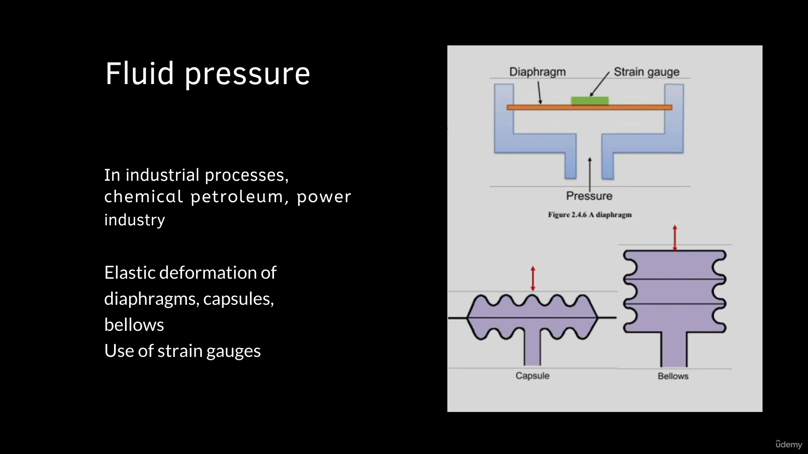

At the start, we will study the sensors required to measure the fluid pressure.

These are diaphragm capsules and bellows.

We will also see how strain gauges are integrated with diaphragm, and how they are useful to measure

the fluid pressure, how Lvdts are integrated with bellows to measure the fluid pressure.

Then we will see how to measure the fluid flow.

The sensors such as orifice meter and turbine meter will be studied.

Then we will study the piezoelectric sensors and tactile sensors.

After that, the important variable that is temperature.

How to measure the temperature.

There are certain important sensors that will be studied.

Some of the sensors, such as bimetallic strips, resistance temperature detectors, thermistors and

thermocouples will be studied.

Finally, we will see how to detect the lights by using the photodiodes.

Next application where sensors are required that is fluid pressure.

So in automation we are using variety of fluids air gas.

Or it may be water or chemicals or many other liquids.

So we need to measure the pressure of this fluid for variety of application.

The most common sensor which is used for measurement of fluid is diaphragm.

It is works based on the elastic deformation principle.

So when we apply pressure on one side of the diaphragm, then there is an elastic deformation of the

diaphragm.

So this elastic deformation can be sensed with the use of strain gauge which is mounted on its the other

side of surface.

And then we can easily find out the pressure in terms of strain that is generated in the strain gauge.

So as we have seen, the strain gauges can be further connected with a Wheatstone bridge which is generating

the required signals.

So when we are using two different diaphragms of corrugated nature.

So here we can consider this is a corrugated diaphragm.

So when we attach two corrugated diaphragm together we are generating a capsule.

The fluid is passed through the capsule and then there is a deformation of the top corrugated diaphragm.

So the displacement of the top portion of the diaphragm is in proportion with the fluid pressure.

So when we are integrating, when we are using multiple number of capsules then it comes the below.

So here you can see this is capsule one.

capsule two and capsule three.

So multiple number of capsules are integrated.

They are stacked over each other.

And then we can have integrated construction that is again utilized to sense the fluid pressure.

The fluid is passage.

So as there is an increase in fluid pressure the top portion of the below will displace.

It will move in upward direction.

 

### 40. LVDT With Bellows

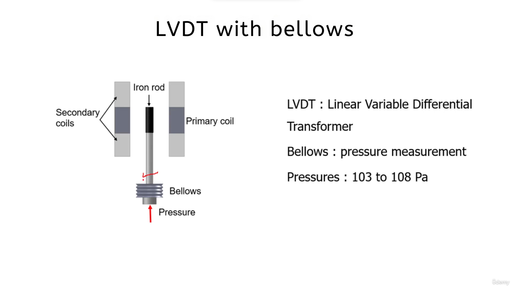

More precise measurement of pressure can be done with bellows when we add the lvdt sensor.

On your screen you can see the Lvdt sensor integrated with the bellows Lvdt.

As you know, it is linear variable differential transformer.

When there is increase in the pressure, the bellows will expand and as the bellows are expanding,

the iron rod inside the lvdt sensor will move.

It will displace.

As the iron rod is displacing, there is generation of EMF across the secondary coils, and that EMF

generated across the secondary coils will give you that EMF generated across the secondary coil is proportional

to the displacement of the rod, and displacement of the rod is proportional to the pressure.

So in this way we can easily measure the pressure using the lvdt attached with the bellows.

So this type of arrangement can be utilized to measure pressures about 103 to 108 Pascal.

 

### 41. Piezoelectric Sensors

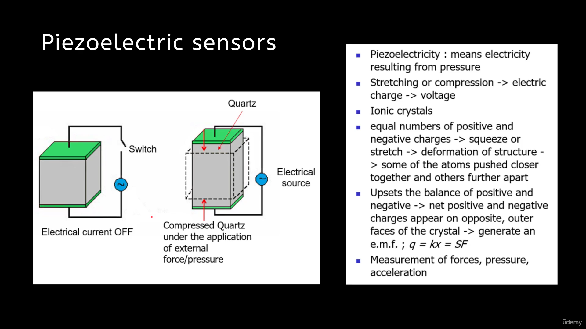

The next type of sensor is piezoelectric sensor.

These are very useful and widely used in the industry.

What is the meaning of piezoelectricity?

Piezoelectricity means the electricity resulting from the pressure.

There are certain materials.

So when we apply a compression force on these materials, or when we stretch these materials, the electric

charge will be developed and that electric charge will generate the voltage.

The voltage generation is proportional to the force or the pressure which is being applied.

These materials are having the ionic crystals.

What happens when we apply the compressive force on these materials at the natural stage?

At the normal stage, there are equal number of positive and negative charges on its surfaces.

But when we squeeze them, or when we apply pressure or force over these materials, there is deformation

of the structure.

During this deformation of the structure, some of the atoms will be pushed closer together and some

of the atoms will be moved apart.

This leads to upsetting the balance of positive and negative charges over its surfaces, and this will

generate an EMF.

In general, the EMF is directly proportional to the application of the force, and the application

of the force is nothing but by what amount you are squeezing or by what amount you are stretching the

material.

You can see Q is directly proportional to x, and k is the proportionality constant.

Piezoelectric sensors are widely used to measure the forces pressure and the acceleration.

 

### 42. Tactile Sensors

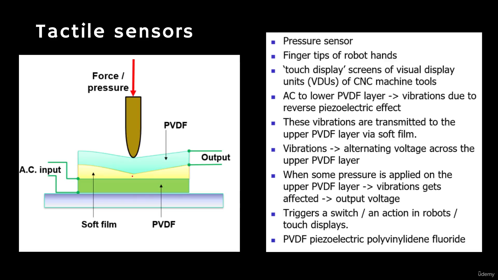

The next interesting sensor is the tactile sensor.

It is used to measure the force or pressure.

These type of sensors are widely used in the automation purpose and robotics.

The fingertips of the robot hands are equipped with the tactile sensor.

Various touch displays or the screens are used in an automated industry or in a typical factory.

Even on the CNC machine tools, we are having the touch screens.

How these touch screens do work A typical construction of the tactile sensor is shown on your screen.

It has basically two layers of piezoelectric material, and that piezoelectric material is pvdf.

The pvdf material is polyvinylidene fluoride.

A soft film or a soft foam is sandwiched in between these two pvdf layers.

We apply AC input to the lower pvdf layer as the material is piezoelectric due to the application of

alternating current, there will be generation of vibrations due to the reverse piezoelectric effect.

We have seen in the previous slide.

As we apply the pressure, there is a change in the voltage.

There is a change in a voltage across the surface of the material.

The reverse is also true if we apply electrical potential.

If we give electrical potential to piezoelectric electric material, there would be expansion of the

material as we give.

AC input to this lower pvdf material, there will be generation of vibrations.

These vibrations will be transferred to the upper pvdf layer.

The upper layer is also.

Piezoelectric material layer.

Due to the vibrations inside this upper layer, there would be generation.

Of electrical potential with uniform supply of the AC input.

We are getting uniform output across the upper pvdf layer, but let us consider we are applying force

or pressure on the top layer.

When a pressure or a force is applied, that force or pressure will disturb the vibrations of the top

layer.

As the vibrations are getting disturbed, there is change in output.

The change in output with respect to the application of force or pressure is calibrated in the laboratories.

Information will further be utilized to take the necessary decision or the action as we are touching

on the screen.

At certain point, there is some function associated with the location of this.

There are certain functions associated with the location of the screen.

Wherever we are touching, as we touch to that particular location.

Microprocessor knows the location as the force is getting applied at that location that will be sensed,

that will be measured, that will be detected, and accordingly, the microprocessor is taking the action.

For example, open and close.

If two buttons are there on the screen that is open and close, as you are touching the location of

the close at the screen, that action will be carried out by the microprocessor.

In robots, when this pvdf top layer will in contact with the objects, that signal will be given to

the microprocessor.

Microprocessor understands like the object is there.

It will detect the object, and accordingly it will actuate its actuators.

For gripping purpose.

We are using the pneumatic power.

The microprocessor will give the instructions to the pneumatic system.

And that pneumatic system will provide the compressed air for the gripping purpose.

 

### 43. Liquid Flow

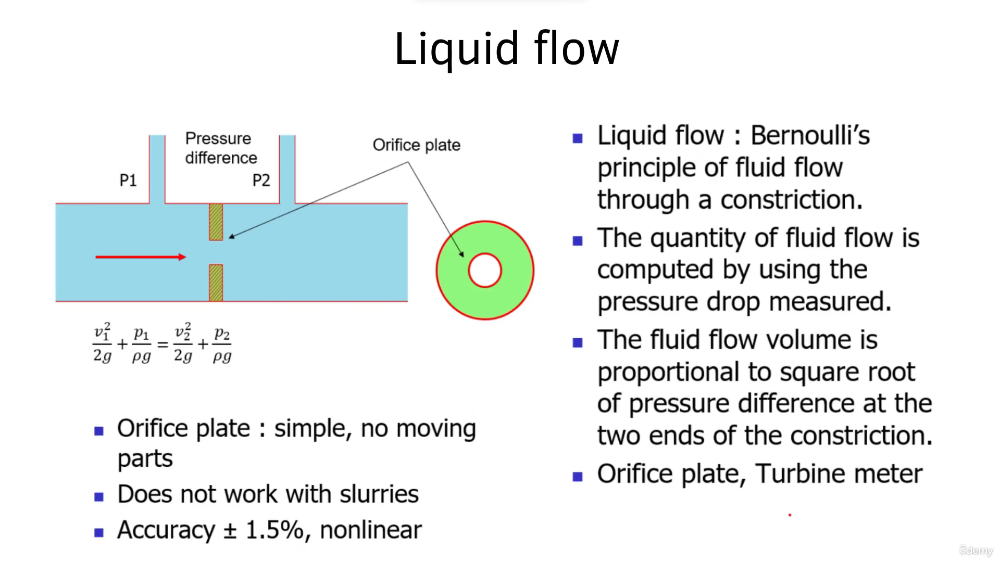

In the industry.

We need to measure the flow of various liquids.

The liquid may be water, the liquid may be the petroleum products or chemicals, or the liquid may

be having certain solid elements that we call the slurries as well.

To measure the flow of the liquid, the very simple and basic sensor is the orifice sensor.

Orifice sensor is working on the principle of Bernoulli's.

As per the Bernoulli's principle of fluid flow, we can measure the quantity of fluid flow by computing

the pressure drop across the constriction in the fluid flow.

The fluid flow volume is proportional to the square root of the pressure difference at the two ends

of the constriction.

This is called as the constriction.

Consider a high pressure fluid is flowing through the pipe.

As the high pressure fluid comes in contact with the constriction that is the orifice plate, there

is obstruction to the fluid flow.

However, it has an opening.

When the fluid is moving through, this opening pressure will drop, but the velocity will increase.

By measuring the drop in pressure, we can easily find out the liquid flow.

The liquid flow is proportional to the square root of the pressure difference at the two ends of the

constriction.

The orifice plate is very simple and it does not have any moving parts, but the sensor is very nonlinear

and the accuracy is about plus or -1.5.

Important limitation of the orifice plate is that it does not work with slurries.

If the liquid is having solid particles, the solid particles will get obstructed and they will settle

in this region.

And due to this there may be clogging of the fluid passage.

 

### 44. Turbine Meter

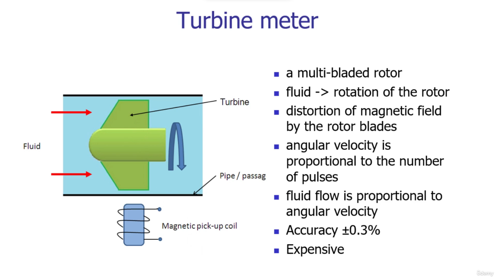

One more popular fluid flow measurement device is turbine meter.

The arrangement is very simple.

We are having multi-bladed rotor.

As the fluid is passing over the multi-bladed rotor, the rotor will rotate in the turbine meter.

We are having a magnetic pickup coil.

When a rotor blade will come in close proximity of the magnetic pickup coil, there is distortion of

the magnetic field of the magnetic pickup coil.

Due to the distortion, a signal will be generated across the magnetic pickup coil and as the number

of times these vibrations will be disturbed, we are getting the pulses.

The frequency of pulses is proportional to the rotation of the turbine.

The frequency of pulses is proportional to the angular velocity of the turbine, and the angular velocity

of the turbine is proportional to the fluid flow rate.

The turbine meter accuracy is better than the orifice plate.

However, the cost associated with the turbine meter is high.

 

### 45. Temperature Measurement

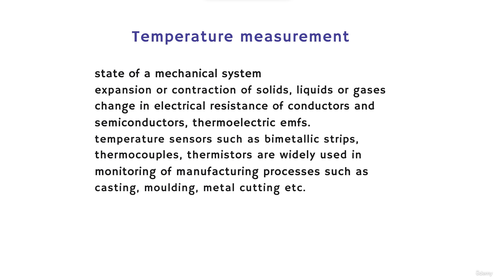

The next set of sensors are the temperature measurement sensors.

Temperature is very critical and important field, variable or parameter in the manufacturing industry.

The temperature are giving us the state of the mechanical system as we know that the temperature is

increasing, it affecting the state of the materials.

If you increase the temperature of the material, it will expand.

And as you reduce the temperature, the materials will contract.

The temperatures are not only affecting the dimensions of the materials, the temperatures are affecting

on its electrical resistances.

In general, various sensors such as bimetallic strips for alarms, thermocouples to measure the temperature

of various components of machine tool thermistors are used.

Various operations which we have seen in our previous lecture, such as casting, molding, and metal

cutting.

In all these applications, we need the measurement of temperature.

 

### 46. Bi-Metallic Strips

Now let us look at the construction working of some of the important temperature measurement sensors.

The first sensor is the bimetallic strips.

It is working as a thermal switch to control the temperature or the heat in a manufacturing process.

Let us consider an example of a furnace furnace we are using to heat up iron or raw metals, and then

we are changing its state from solid to liquid.

The liquefied metal will be utilized for the casting operation, but we want to have the controlled

heating of this material.

The excessive heating may burn the material or may be hazardous to the entire system.

To control the heating, we need to cut off the electric supply to the furnace.

For that purpose, the bimetallic strips would be useful.

The construction of a typical bimetallic strip can be seen on your screen.

It has two strips, and these two strips are bonded together.

We can call it as a composite strip.

The top layer of the composite strip is having the material with high coefficient of expansion.

At the inside.

We are having a material with low coefficient of expansion.

One end of bimetallic strip is fixed, the other end is free.

At the other end we are having a soft iron.

This soft ion is in proximity with a magnet.

There is a knob which will set the distance between the small magnet and soft ion.

If we heat up this composite layer, if we increase the temperature of this composite layer, top layer

of the composite strip will expand.

Its coefficient of expansion is high.

It will try to expand, but the inner layer whose coefficient of expansion is less will restrict the

movement of the top layer.

Due to this, the entire composite layer will be converted into a curved shape, and as the shape is

getting changed, the soft iron will come closer to the small magnet.

As the soft iron will come closer to the small magnet, there would be a contact and as there is a contact

between the soft iron and the small magnet, the electric circuit will be completed.

When the electric circuit will be completed, it will generate an alarm or it will generate a signal.

That signal will be given to the microprocessor.

The microprocessor will take the decision to cut off or to stop the flow of electric current inside

the system.

In this way, we can control the heating of the system above the preset value of the temperature.

 

### 47. Construction Of Rtd

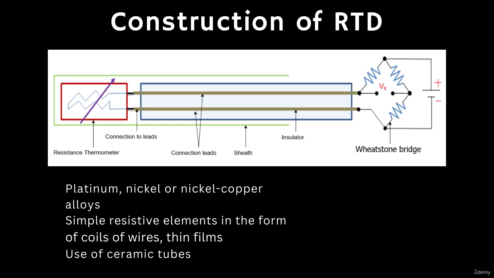

The next temperature measurement sensor is resistance temperature Detector.

It is very popular and it is called as rtds.

The principle is very simple.

There are certain materials whose resistance will increase with the application of heat energy.

On your screen, you can see the plot of the increased resistance of certain materials such as nickel,

copper and platinum, and they do generally follow the equation of increase in resistance, as you can

see on the screen.

DT is equal to rho into one plus alpha into t dt is the resistance at temperature T.

This t temperature is the temperature that we want to measure.

Rho is the temperature at zero degrees Celsius.

Alpha is the temperature coefficient of resistance.

The ratio of dt by rho is plotted here.

This sensor must be utilized along with a signal processing device.

The sensor must be used along with the Wheatstone bridge because the rtds are providing the change in

resistance, but the microprocessor knows the language of voltage to convert the information from the

RTD, that is, delta R that will be converted into the delta V by using the Wheatstone bridge.

The typical construction of RTD can be seen on your screen.

You can see this is the resistive element which is made up of the nickel, platinum or copper.

This resistive element is connected to the leads.

The connecting leads are properly insulated and through the leads we are getting the signal in terms

of change in resistance.

This entire construction is properly protected with the sheet, because we are using these materials

in hazardous or harsh working conditions.

 

### 48. Various Its Applications Rtds

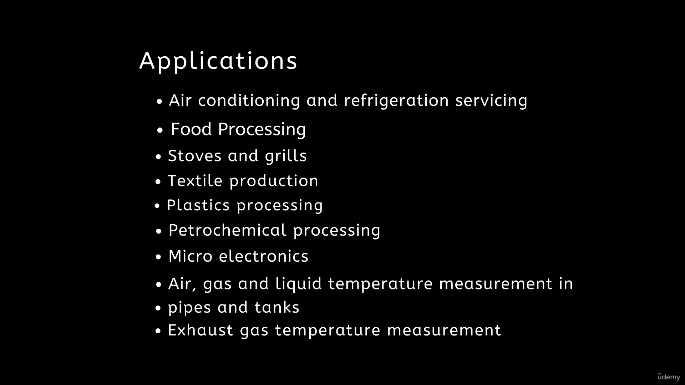

Now friends, let us see what our various its applications rtds are used in air conditioning refrigeration.

They are also used in food processing to control the temperatures of stores and grills in textile production.

Textile to process the fibers in plastics processing.

So plastic.

We are using the injection molding machines.

And in the injection molding machine we should have the controlled liquefaction of the plastic material

or the polymers.

Petrochemical processing.

In microelectronics, the accuracy of rtds is quite high.

We are also using these rtds to measure the temperatures of air, gas and liquid.

The rtds are also used in automobile applications and energy applications where we need to measure temperature

of the exhaust gas.

 

### 49. Thermistors And Applications

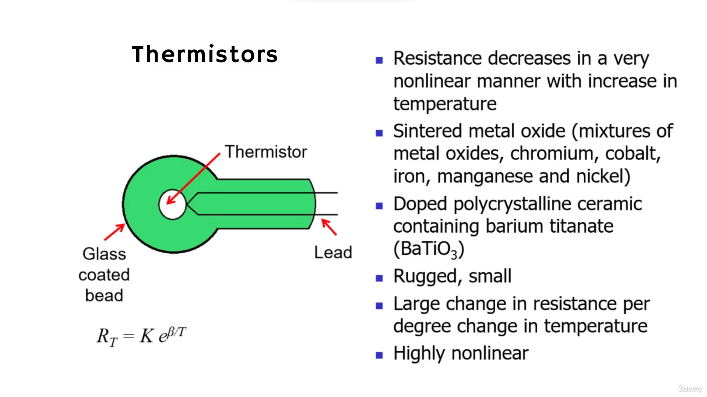

 

### 50. Thermocouple

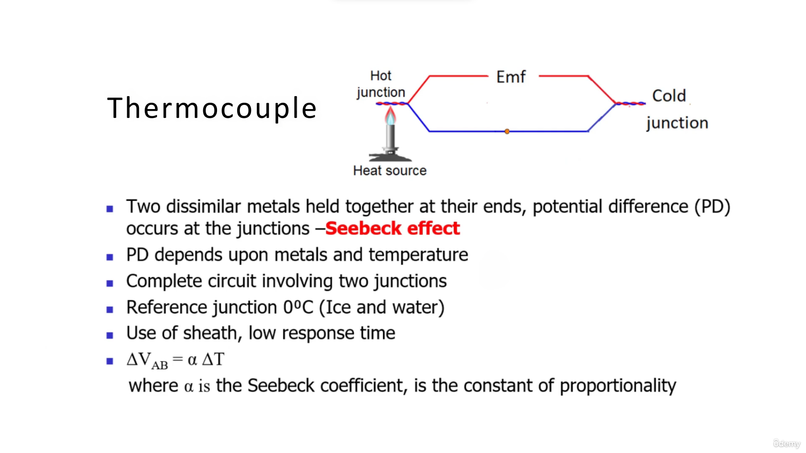

One more important temperature measurement sensor is thermocouple.

It is very much used in the process monitoring and control of manufacturing operations such as welding.

The thermocouple is working based upon the Seebeck effect.

What is this Seebeck effect?

The Seebeck states that when two dissimilar materials they held together at their ends, then there

will be a potential difference occurs at the junctions, and this potential difference is proportional

to the temperature at these junctions.

Let us consider two dissimilar materials are connected at their ends.

One end is getting heated up.

However, the other end is cold, zero degrees Celsius.

To have the junction at zero degrees Celsius, we are using ice and water.

When we apply the external heat source at the other junction, there is increase in temperature of this

junction.

Due to this increase in temperature due to application of heat energy, the electrons will be excited

and they will start moving from the hot junction to the cold junction.

And there is formation of electric current.

But due to the movement of the electrons, there will be creation of valency at the hot junction.

To balance it out, the electrons from cold junction will be moving towards the hot junction.

However, the energy at cold junction is comparatively less.

Therefore, the speed of electrons would be less.

In this way, as the number of electrons are moving from the hot junction to the cold junction, the

negatively charged particles would be more at the colder junction, and the positively charged particles

would be more at the hot junction.

Due to this, there would be generation of potential difference, and that potential difference will

create the electromotive force.

The magnitude of the EMF will be in proportion to the difference of temperature at hot junction and

the cold junction.

We know the temperature of the cold junction.

Then we can easily compute the temperature of the hot junction.

 

### 51. Thermocouple Materials

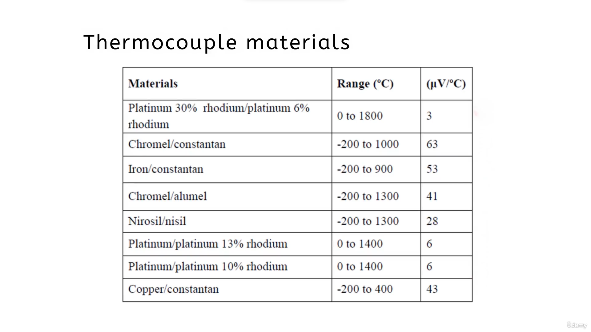

A variety of materials are used in the measurement of the temperature based upon the Seebeck effect.

These materials can be seen on your screen.

The first type of thermocouple material combination is platinum and rhodium rhodium with 30 percentage.

This is one wire or one material.

It is connected with the other material that is platinum with six percentage of the rhodium.

Then we can have a combination of Cromwell and Constantin Iron and Constantin Cromwell, and aluminum

Nitrosyl and nickel, then platinum and platinum with 13% of rhodium, platinum and platinum with 10%

of the rhodium.

And we can have the copper and constant.

In this way.

A variety of combinations are available in the market, and we need to choose a proper combination based

upon its application.

To choose the thermocouple material, we have to look at the range of the temperature for our application.

On your screen, you can see the respective ranges of temperature measurement.

In addition to this, the sensitivity values are also provided.

These sensitivity values will help you to choose the proper thermocouple material.

 

### 52. Light Sensors Photo Resistor And Its Applications

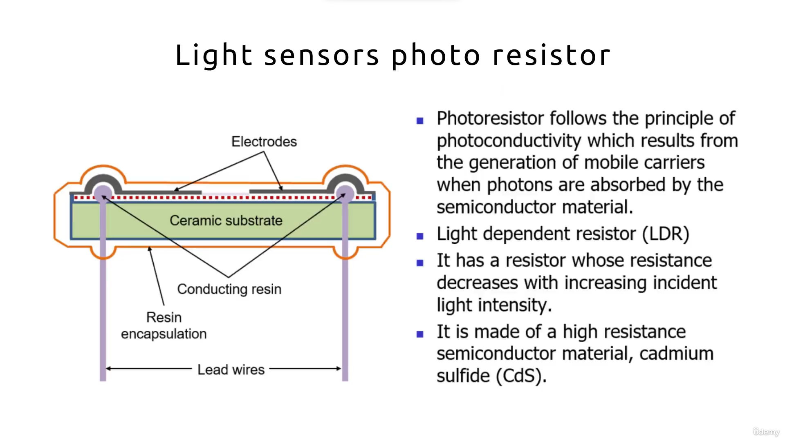

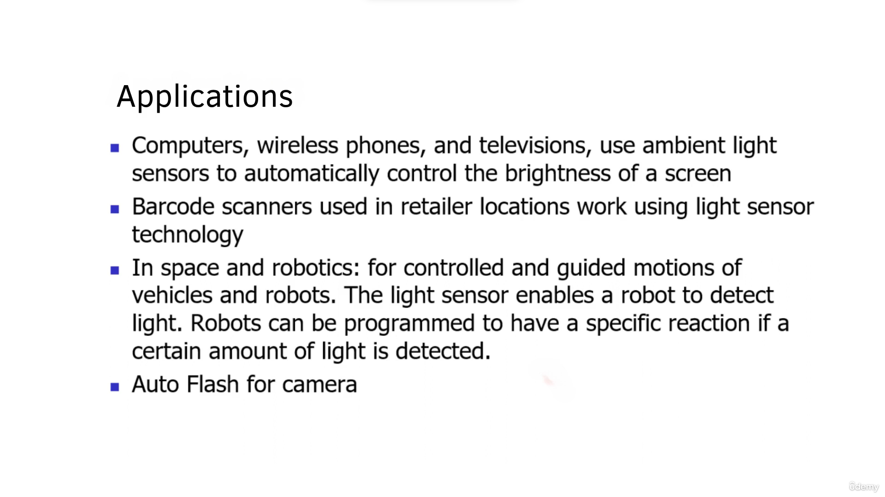

We also require to sense the light in automation.

For that purpose, we are using photo registers.

The photo register follows the principle of photoconductivity.

In Photoconductivity, there is generation of mobile carriers when photons are absorbed by semiconductor

materials, when the light energy will be incident on semiconductor materials, these materials will

absorb the photons and due to the absorption of the photons, there is a generation of mobile carriers,

and in this way, these mobile carriers will generate a signal that can be utilized to measure the light.

To sense the light, the photon registers are also called as the light dependent resistors.

Elders.

These elders do have resistors whose resistance is decreasing with increasing incident of light intensity.

These materials are cadmium sulfide.

This is the semiconductor material and their resistance is very high and that will be utilized to detect

the light.

These sensors are used in computers, wireless phones and televisions.

When more ambient light is incident upon these sensors, they will automatically control the brightness

of this screen.

The elders are also used in barcode scanners, which you might have seen at various retailers, at retail

stores, in space and robotics.

We need to have a very controlled and guided motion of various vehicles and robots in automated industry.

These elders are enabling the robots to detect the light.

Accordingly, the robots are choosing the path of movement.

The robots can be programmed to have a specific reaction if the certain amount of light is detected.

 

### 53. Photo Diodes And Its Applications

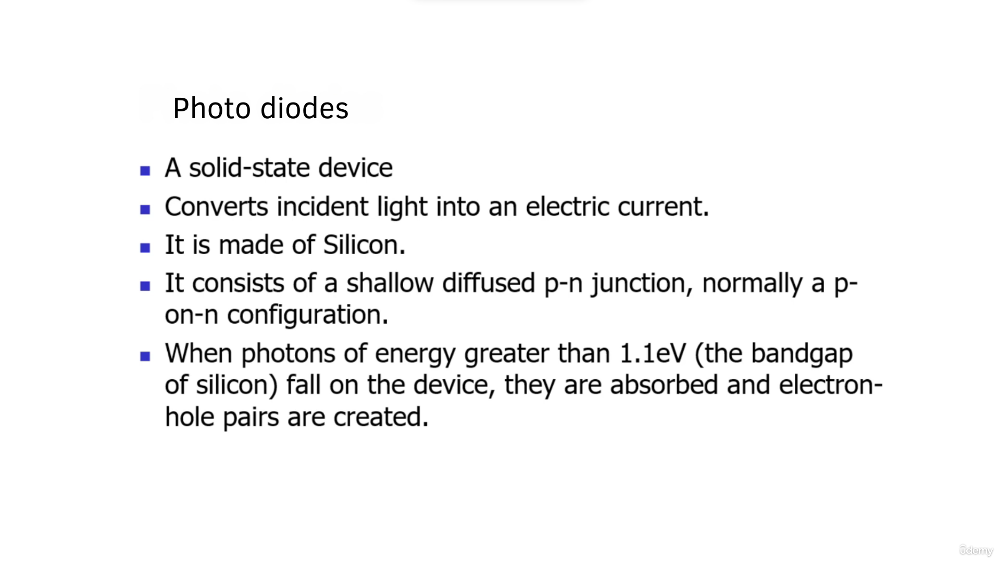

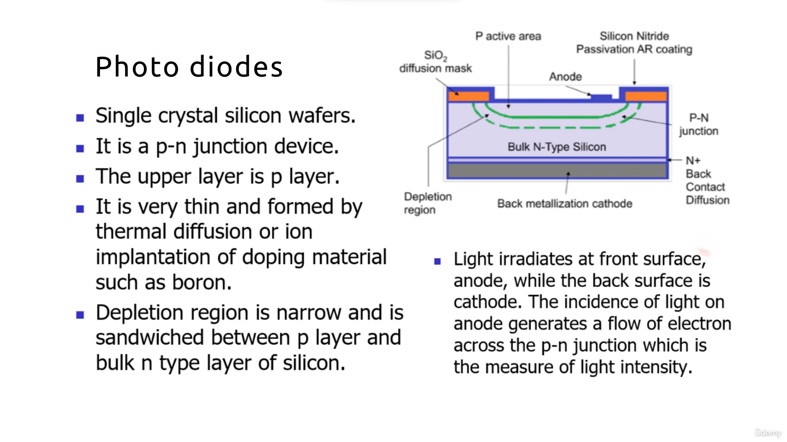

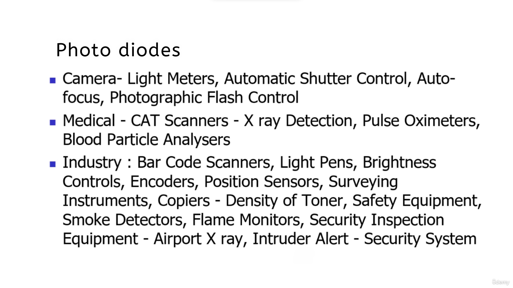

Moreover, these are used in auto flash for camera and the industrial process control.

The next sensor is photodiode.

It is a solid state device and it converts the incident light into an electric current.

Photodiodes are made up of silicon and they do consist of shallow diffused p n junction, normally a

p on n configuration.

When photons of energy more than 1.1 of electron volt fall on the device, it will be absorbed and electron

hole pairs will be created.

Now let us study the construction of the photodiode.

It is constructed on single crystal silicon wafer.

The constructional details are shown on your screen.

The photodiodes are also called as p-n junction devices.

In p-n junction device, the upper layer is the p layer.

It is thin and it is generally formed by using either thermal diffusion technique or by ion implantation

technique.

The boron is doped inside this p material.

The bottom layer that is the n layer is bulkier one, and the junction of P and n layers is called as

the PN junction.

This is also called as the depletion region.

The depletion region is narrow and it is get sandwiched between the player and the end layer.

The principle of operation of photodiode is very simple.

When the light is incident on the anode surface, there is generation of electric current.

The photons which are incident on the anode will get absorbed in the PN junction layer, and the photons

which are incident on the anode will get absorbed.

And then there is a flow of electrons across the PN junction.

Due to this flow of electrons, there is a generation of electric current and that is the measure of

the incident light energy.

The photodiodes have a variety of applications.

They are primarily used in cameras for the measurement of light, to control the shutters, to carry

out the autofocusing operation on the objects, and to have the flash control.

In addition to this, the photodiodes have applications in medical industry.

In medical industry, we required many scanners, x ray detection units, measurement of oxygen levels,

and analysis of blood particles.

In all these applications, the photodiodes are extensively used.

Moreover, in the automation industry, the photodiodes are used for scanning purpose to control the

brightness, for encoding purpose, to measure the position.

They are also used in surveying instruments copiers to measure the density of toner.

One important application of photodiodes is in safety equipment like detection of smoke.

Monitoring of flames.

These diodes are also used for security inspection equipment such as x ray scanning instrument, the

system which is providing intruder alert alarm system, so on and so forth.

Well, my friends, there are a variety of sensors being used in automation industry.

In the present course, we have seen a limited variety of sensors.

You can explore the advanced sensors available in the market, study them carefully, and can utilize

in your projects.

 

### 54. Selection Of Sensors

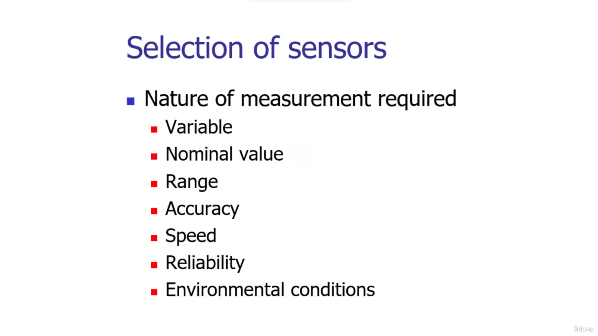

When we choose a sensor for typical application, we need to first look at what kind of measurement

for which we are selecting the sensor.

What is the variable?

Whether it is for measurement of temperature or force or pressure?

What is the nominal value that we are anticipating for the measurement?

What is the value that we are expecting to be measured?

Then what could be the range then how accurate the results are expected, in what speed we want the

signals from a sensor, and how much the reliability of the sensor would be.

For safety applications, the sensors should be reliable.

In addition to these parameters, the environmental condition in which the sensors will be employed

if the environmental conditions are harsh, such as it may have a lot of dirt or a temperature or humidity

under these all environmental conditions, whether the chosen sensor will work properly or not.

These things are very important when we choose a particular sensor for our application.

 
