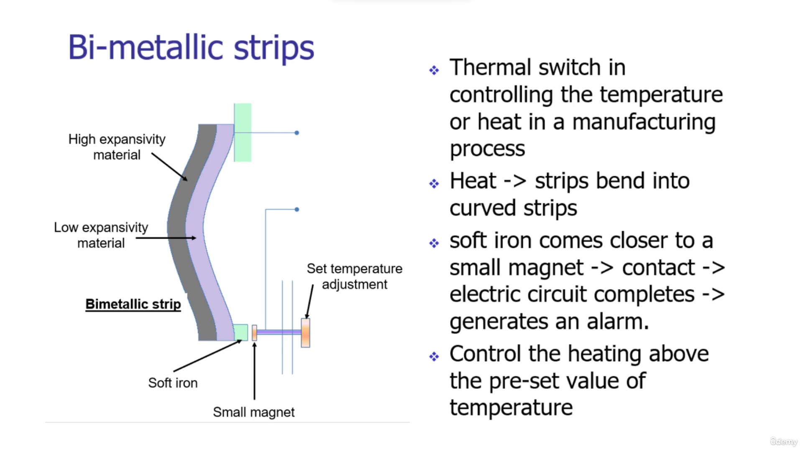

39. [Fluid Pressure](#39)
40. [LVDT With Bellows](#40)
41. [Piezoelectric Sensors](#41)
42. [Tactile Sensors](#42)
43. [Liquid Flow](#43)
44. [Turbine Meter](#44)
45. [Temperature Measurement](#45)
46. [Bi-Metallic Strips](#46)
47. [Construction Of Rtd](#47)
48. [Various Its Applications Rtds](#48)
49. [Thermistors And Applications](#49)
50. [Thermocouple](#50)
51. [Thermocouple Materials](#51)
52. [Light Sensors Photo Resistor And Its Applications](#52)
53. [Photo Diodes And Its Applications](#53)
54. [Selection Of Sensors](#54)

---

 
 

### 39. Fluid Pressure

 

### 40. LVDT With Bellows

 

### 41. Piezoelectric Sensors

 

### 42. Tactile Sensors

 

### 43. Liquid Flow

 

### 44. Turbine Meter

 

### 45. Temperature Measurement

 

### 46. Bi-Metallic Strips

 

### 47. Construction Of Rtd

 

### 48. Various Its Applications Rtds

 

### 49. Thermistors And Applications

 

### 50. Thermocouple

 

### 51. Thermocouple Materials

 

### 52. Light Sensors Photo Resistor And Its Applications

 

### 53. Photo Diodes And Its Applications

 

### 54. Selection Of Sensors

 
